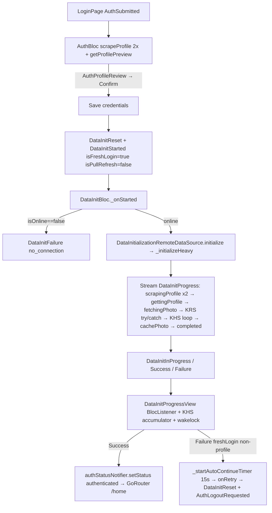
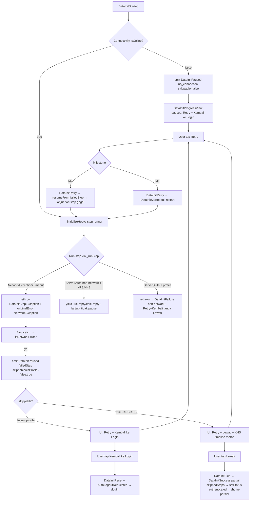

# Fresh Login Network Pause — Retry & Lewati di Step Gagal — Design Spec

**Date:** 2026-09-08
**Status:** Approved (brainstorming 6/6 + unittest detail approved)
**Scope:** Fresh login pipeline overlay (`isFreshLogin: true`) — pause di step gagal jaringan, tombol Retry/Lewati & Retry/Kembali ke Login
**Approach:** Opsi A — Stateful Pause + Resume Granular (Checkpoint), milestone M1→M2

---

## Ringkasan & Latar Belakang

### Masalah hari ini

`LoginPage` fresh login (`DataInitProgressView(isFreshLogin: true)` inline, bukan `DataRefreshOverlay`) menjalankan pipeline `DataInitBloc → DataInitializationRemoteDataSource._initializeHeavy` dengan 8+ step:

```
scrapingProfile (2x) → gettingProfile (wajib) → fetchingPhoto (opsional, best-effort)
→ downloadingKrs → extractingKrs → fetchingKrsData   (try/catch → krsEmpty, non-fatal)
→ fetchingKhsSemesters → loop(downloadingKhs/extractingKhs/fetchingKhsData) per semester (try/catch → khsEmpty, non-fatal)
→ cachePhoto → completed
```

Perilaku sekarang:
- `DataInitBloc._onStarted` fail-fast `ConnectivityService.isOnline==false` → `DataInitFailure(no_connection)` (benar).
- `profile_get` gagal (wajib) → `rethrow` → `DataInitFailure` → `DataInitProgressView` tampil error view. Di `isFreshLogin` ada auto-timer `kStepErrorAutoContinue = 15s` yang manggil `onRetry → DataInitReset + AuthLogoutRequested` (logout) jika bukan profile error — ini yang bikin fresh login koneksi hilang 15 detik kemudian ke-logout.
- `KRS/KHS` gagal (opsional) → `catch → yield krsEmpty/khsEmpty` **silent**, pipeline lanjut, akhirnya `completed` → `authStatusNotifier.setStatus(authenticated)` → dashboard tanpa indikator. User tidak tahu step mana gagal.
- Hasil: saat koneksi tiba-tiba hilang di tengah pipeline, semua error "tenggelam" hingga completed, user dilempar ke dashboard dengan data parsial tanpa kontrol.

### Permintaan

Jika koneksi bermasalah di tengah pipeline fresh login:
- Pipeline **berhenti tepat di step/pipeline ke berapa** yang gagal.
- Tampilkan tombol **Retry** dan **Lewati**.
- **Lewati** = skip proses KRS/KHS/posisi step yang gagal → langsung masuk dashboard dengan data yang sudah terkumpul. **Kecuali** data profile (wajib) — tidak ada Lewati, hanya **Retry** atau **Login Ulang (Kembali ke Login)**.
- Hanya untuk error jaringan; error lain (server/auth) tetap perilaku lama.
- `DataRefreshOverlay` (pull-refresh) tidak diubah — tetap auto-close 3 detik tanpa tombol.

### Keputusan Q1–Q5 (terkunci)

| Q | Pertanyaan | Jawaban terkunci |
|---|---|---|
| Q1 | Arti Lewati | **B** — abort sisa pipeline, langsung dashboard (tidak lanjut step berikutnya) |
| Q2 | Arti Retry | **C** — coba step yang gagal + lanjut normal (resume granular) |
| Q3 | Profile gagal | **A** — dua tombol **Retry** + **Kembali ke Login** (logout), tanpa Lewati |
| Q4 | Kapan pause | **A** — hanya `NetworkException` + `TimeoutException` + `no_connection`, bukan `ServerException`/`AuthException` |
| Q5 | Lewati → dashboard | **A** — via `authStatusNotifier.setStatus(authenticated)` (wajib, kalau tidak `authRedirect` tendang ke `/login`); siapkan `skippedSteps` untuk indikator parsial (silent → banner follow-up) |

### Pendekatan terpilih

**Opsi A — Stateful Pause + Resume Granular (Checkpoint), milestone M1→M2.**
- M1: pause + tombol + Retry full-restart (shippable cepat, perilaku benar secara UX).
- M2: resume granular dari step gagal (hemat 2× scrape, ideal untuk KHS banyak semester).
- Opsi B (full-restart forever) dan Opsi C (overlay-only hold) ditolak — B boros di jaringan jelek, C tidak penuhi Q1 untuk KRS/KHS.

---

## Tujuan & Non-Tujuan

### Tujuan

- Fresh login koneksi hilang → pause di step gagal, tampil error view dengan tombol kontekstual, tidak auto-logout / tidak auto-dismiss ke dashboard.
- Tombol KRS/KHS/posisi: **[Retry] [Lewati]** — Retry coba step gagal + lanjut normal, Lewati abort sisa → dashboard parsial.
- Tombol Profile: **[Retry] [Kembali ke Login]** — tanpa Lewati.
- Pause hanya untuk error jaringan (`NetworkException`/`TimeoutException`/`no_connection`); error lain tidak pause (KRS/KHS swallow → `Empty`, profile → `Failure` biasa).
- Hapus auto-timer 15 detik → logout untuk fresh login; ganti hold sampai user tap.
- KHS timeline tetap tampil di bawah error (badge merah untuk semester gagal), header tetap centered.
- Cache parsial tetap dipakai; dashboard render `Empty` untuk blok yang di-skip/gagal.

### Non-Tujuan

- `DataRefreshOverlay` pull-refresh (`isPullRefresh: true`) tidak diubah — tetap auto-close 3 detik tanpa tombol.
- Tidak ada retry backoff/exponential, debounce tambahan, atau perubahan `OfflineSheetController`/`ConnectivityCubit`.
- Tidak ada perubahan `ApiClient` envelope, `AppRouter`, atau `AuthBloc` submit flow.
- Tidak ada perubahan `DataInitializationPage` legacy (sudah redirect ke home).
- Tidak ada auto-retry saat jaringan kembali — hanya manual tap Retry.

### Definisi Sukses (observabel)

1. Matikan WiFi/data saat `downloadingKrs` → overlay berhenti, chip step "Mengunduh KRS", tombol Retry+Lewati muncul, tidak ke dashboard, tidak logout 15 detik kemudian.
2. Tap Retry saat jaringan kembali → pipeline lanjut `extractingKrs → fetchingKrsData → KHS → completed` → dashboard.
3. Tap Lewati di KRS/KHS → langsung dashboard, Home render profile ada, KRS `Empty`, KHS yang sudah terkumpul tampil.
4. Matikan jaringan di `scrapingProfile`/`gettingProfile` → tombol Retry + Kembali ke Login saja, Lewati tidak ada.
5. `ServerException 500` di KRS/KHS → tidak pause (tetap `krsEmpty`/`khsEmpty` silent, tidak ada tombol).
6. `no_connection` di awal (fail-fast) → pause profile (Retry+Kembali) — tidak langsung ke dashboard.
7. Timeout global `kDataInitTimeout` → pause dengan `failedStep=timeout`, tombol sesuai posisi.

---

## Arsitektur & Komponen

### File yang disentuh

| Layer | File | Perubahan |
|---|---|---|
| Domain | `lib/features/data_initialization/domain/entities/data_initialization_entity.dart` | Tambah enum `DataInitStep` (checkpoint) + field `skippedSteps` jika perlu; tidak ubah `DataInitProgress` selain detail reuse |
| Data | `lib/features/data_initialization/data/datasources/data_initialization_remote_data_source.dart` | Refactor pipeline jadi step runner; method `resumeFrom(DataInitStep)`; bedakan `NetworkException` → rethrow (pause) vs non-network → swallow; simpan `npm/password/forceRefresh/photoBytes/semesters` untuk resume |
| Presentation BLoC | `lib/features/data_initialization/presentation/bloc/data_initialization_bloc.dart` | Simpan `npm/password/forceRefresh`, `lastCompletedStep`, `photoBytes`, `cachedSemesters`; handle `DataInitRetry`/`DataInitSkip`; emit `DataInitPaused` |
| Presentation BLoC | `lib/features/data_initialization/presentation/bloc/data_initialization_event.dart` | Tambah `DataInitRetry`, `DataInitSkip` (+ `DataInitAbortToDashboard` jika perlu alias Skip) |
| Presentation BLoC | `lib/features/data_initialization/presentation/bloc/data_initialization_state.dart` | Tambah `DataInitPaused` (atau perluas `DataInitFailure` dengan `isNetworkError/skippable`) — rekomendasi state terpisah |
| Presentation UI | `lib/features/data_initialization/presentation/widgets/data_init_progress_view.dart` | Hapus `_startAutoContinueTimer` 15s→logout untuk fresh login; error view dinamis (profile vs KRS/KHS); wiring `onRetry`→`DataInitRetry`, `onSkip` baru |
| Presentation UI | `lib/features/auth/presentation/pages/login_page.dart` | Sambung `onRetry`/`onSkip`/`onCancel` baru ke BLoC event; `BlocListener` deteksi `Paused→Success(partial)` → `setStatus(authenticated)` |
| Core | `lib/core/errors/app_errors.dart` | Tidak ubah hierarki; hanya dokumentasi `DataInitStepException.originalError` untuk classifier |
| Core | `lib/core/utils/error_handler.dart` | Tidak ubah mapping, hanya dipakai `toHumanReadable` |
| Core | `lib/core/constants/app_strings.dart` | Tambah label tombol & hint paused |
| Core | `lib/features/data_initialization/presentation/widgets/data_init_status_text.dart` | Reuse untuk chip step di paused view |

### File yang TIDAK disentuh

`data_refresh_overlay.dart`, `api_client.dart`, `connectivity_service.dart`, `app_router.dart`, `auth_bloc.dart`, `data_initialization_page.dart`, `offline_sheet_controller.dart`.

### Dependency rule

Tetap `presentation → domain → data`, tidak terbalik. Domain definisikan `DataInitStep` enum; data implementasikan runner.

### Milestone

- **M1 (shippable):** BLoC pause + tombol + Retry = full `DataInitStarted` restart, Lewati = `DataInitSuccess(partial)` → dashboard. Datasource hanya ubah `catch` KRS/KHS untuk rethrow network. Spec tetap tulis A, verifikasi M1 dulu.
- **M2 (granular):** `resumeFrom` + checkpoint; Retry tidak ulang `scrapeProfile 2x` jika gagal di KHS akhir. Timeout per-resume direset.

---

## Alur Data

### Baseline (sekarang)



### Alur baru saat koneksi hilang



**Catatan nav:** `setStatus(authenticated)` tetap di `LoginPage` listener (pemilik navigasi), bukan di BLoC. `DataInitSkip` hanya ubah BLoC → `Success(partial)`.

---

## Penanganan Error & State

### Klasifikasi error (Q4-A)

| Sumber | Exception | Pause? | Tombol |
|---|---|---|---|
| `ApiClient._executeRequest` `SocketException`/`TimeoutException` → `NetworkException` | `NetworkException` | Ya | KRS/KHS: Retry+Lewati, Profile: Retry+Kembali |
| `ConnectivityService.isOnline==false` di awal `_onStarted` | `DataInitFailure(no_connection)` / `Paused` | Ya | sama |
| `DataInitStepException.originalError is NetworkException` | wrapped network | Ya | sama |
| `TimeoutException` global `kDataInitTimeout` | timeout | Ya (dianggap network) | Retry+Lewati (KRS/KHS) |
| `ServerException` 500/403/404 | non-network | Tidak | tidak pause; KRS/KHS → `krsEmpty`/`khsEmpty` silent, profile → `Failure` biasa |
| `AuthException` 401 | non-network | Tidak | sama, profile tanpa Lewati |
| `ValidationException`, parse error | non-network | Tidak | sama |

### State baru

Rekomendasi: **state terpisah** `DataInitPaused` agar `BlocListener` bisa bedakan `Failure` non-network vs `Paused` network dengan jelas; test lama `is DataInitFailure` tidak pecah untuk non-network path.

```dart
class DataInitPaused extends DataInitBlocState {
  final String failedStep; // 'profile_scrape_1'|'profile_get'|'krs_download'|'khs_download_Ganjil'|...
  final String message;    // human readable via ErrorHandler
  final bool skippable;    // false untuk profile_*, true untuk KRS/KHS
  final bool isNetworkError; // true untuk network/timeout/no_connection
  const DataInitPaused(this.message, {required this.failedStep, required this.skippable, this.isNetworkError = true});
  // ==/hashCode
}

class DataInitSuccess extends DataInitBlocState {
  final bool isPartial;           // true jika via Lewati (M1/M2)
  final List<String> skippedSteps; // step yang di-skip, kosong jika completed penuh
  const DataInitSuccess({this.isPartial = false, this.skippedSteps = const []});
}

// Alternatif perluasan (kompatibel tapi kurang eksplisit):
// class DataInitFailure { final bool isNetworkError; final bool skippable; }
```

Pemilihan: **DataInitPaused terpisah** (prefer), `DataInitFailure` tetap untuk non-network. `DataInitSuccess` diperluas dengan `isPartial/skippedSteps` (default `false/[]` sehingga `const DataInitSuccess()` lama tetap kompatibel — tidak pecah test existing yang `expect(DataInitSuccess)`).

### Event baru

```dart
class DataInitRetry extends DataInitEvent { const DataInitRetry(); }
class DataInitSkip extends DataInitEvent { const DataInitSkip(); }
```

- M1: `DataInitRetry` → handler re-dispatch `DataInitStarted(npm, password, forceRefresh)` full.
- M2: `DataInitRetry` → handler call `datasource.resumeFrom(failedStep, npm, password, forceRefresh)`.
- `DataInitSkip` → guard `if (!skippable) return;` → emit `DataInitSuccess(partial)` dengan `skippedSteps` (atau field di BLoC).

### Classifier

```dart
bool _isNetworkError(Object e) {
  if (e is NetworkException) return true;
  if (e is TimeoutException) return true;
  if (e is DataInitStepException && e.originalError is NetworkException) return true;
  // failedStep == 'no_connection' || 'timeout' juga dianggap network
  return false;
}
bool _isProfileStep(String step) => step.startsWith('profile');
bool get skippable => !_isProfileStep(failedStep);
```

### Guard

- `skippable = !failedStep.startsWith('profile')`.
- `_isRunning` tetap jaga concurrent; `DataInitReset` hanya boleh saat tidak running (seperti sekarang).
- `DataInitSkip` saat `skippable==false` → no-op (tetap Paused).

### Datasource catch refactor

```dart
try {
  // KRS block: download → extract → fetchKrsData
} catch (e) {
  if (_isNetworkError(e)) rethrow; // → Bloc pause
  _logStepOutcome(error); yield const DataInitProgress(DataInitStatus.krsEmpty);
}
try {
  // KHS semesters
} catch (e) {
  if (_isNetworkError(e)) rethrow;
  yield const DataInitProgress(DataInitStatus.khsEmpty);
}
// loop per-semester: catch network → rethrow (pause granular, M2) atau rethrow + sentinel? M2: pause di semester itu
```

Untuk per-semester M1: tetap rethrow network → pause di semester itu (user Retry full). M2: sama tapi resume hanya semester itu.

---

## Desain UI / Widget

### `DataInitProgressView` (`isFreshLogin: true`)

- **Hapus** `_startAutoContinueTimer` 15s → `onRetry→logout` untuk fresh login. Ganti hold paused (tidak ada countdown).
- **Listener:** `DataInitPaused` → tidak clear `_khsMap` (keep timeline untuk debug), `wakelock.disable()`.
- **Error view dinamis** (`_buildErrorView` di-branch `is DataInitPaused` vs `is DataInitFailure`):
  - Header sama (ikon error + chip step + message + hint).
  - Chip step: `_humanReadableFailedStep(state.failedStep)` reuse `dataInitStatusText` untuk `krs_download→"Mengunduh KRS"`, `timeout→"Batas waktu"`, `no_connection→dataInitNoConnectionStep`.
  - Tombol:
    - `isProfileError(failedStep)` → Row `[FilledButton.icon Retry] [OutlinedButton Kembali ke Login]`
    - else (KRS/KHS/posisi) → Row `[FilledButton.icon Retry] [OutlinedButton Lewati]`
    - `DataInitFailure` non-network KRS/KHS tidak masuk paused → tidak tampil Lewati (swallow path tidak render error view).
  - `onRetry` → `context.read<DataInitBloc>().add(const DataInitRetry())` (bukan `AuthLogoutRequested`).
  - `onSkip` (baru, `VoidCallback? onSkip`) → `add(const DataInitSkip())`.
  - `onCancel` (Kembali ke Login) → `add(const DataInitReset())` + `context.read<AuthBloc>().add(const AuthLogoutRequested())` (via LoginPage, tidak di view).
  - **Tidak ada Countdown text.**
- **KHS timeline** tetap di bawah error header (seperti sekarang) — step gagal badge merah, sukses hijau.
- **`isFreshLogin: false` (pull-refresh overlay)** tidak diubah — tetap tanpa tombol, auto-close 3s (guard `if (!widget.isFreshLogin)`).

### `LoginPage`

```dart
BlocListener<DataInitBloc, DataInitBlocState>(
  listener: (context, state) {
    if (state is DataInitPaused) { /* DataInitProgressView sudah handle UI, tidak nav */ }
    if (state is DataInitSuccess) {
      // termasuk partial dari Skip — DataInitSuccess(partial) sama dengan completed
      widget.authStatusNotifier.setStatus(AuthStatus.authenticated);
    }
  },
  child: BlocBuilder<AuthBloc, AuthState>(
    // ...
    AuthAuthenticated → DataInitProgressView(
      isFreshLogin: true,
      onComplete: () => widget.authStatusNotifier.setStatus(AuthStatus.authenticated),
      onRetry: () => context.read<DataInitBloc>().add(const DataInitRetry()),
      onSkip: () => context.read<DataInitBloc>().add(const DataInitSkip()),
      onCancel: () {
        context.read<DataInitBloc>().add(const DataInitReset());
        context.read<AuthBloc>().add(const AuthLogoutRequested());
      },
    ),
  ),
)
```

- `onRetry` untuk fresh login tidak lagi `AuthLogoutRequested`; hanya `DataInitRetry`.
- `onSkip` baru; `LoginPage` listener untuk `DataInitSuccess` (termasuk partial) → `setStatus(authenticated)`.

### `AppStrings` baru

`refreshErrorRetry = 'Coba Lagi'` **sudah ada** (`refreshErrorRetry`), jadi reuse — jangan duplikat. Tambahan baru:

```dart
static const refreshErrorSkip = 'Lewati';
static const refreshErrorBackToLogin = 'Kembali ke Login';
static const refreshErrorPausedHintNetwork = 'Koneksi terputus. Periksa internet lalu coba lagi atau lewati.';
```

`refreshErrorSkip`/`BackToLogin`/`PausedHintNetwork` baru; `refreshErrorTitle`, `refreshErrorStepPrefix`, `refreshErrorHint`, `refreshErrorStepUnknown`, `dataInitNoConnection`, `dataInitNoConnectionStep` reuse. Tidak ada `refreshErrorPausedStepPrefix` terpisah — pakai `refreshErrorStepPrefix` yang ada.

### Theming & aksesibilitas

- Tombol primer Filled (Retry), sekunder Outlined (Lewati/Kembali) — konsisten tema `primary`/`surfaceContainerHighest`.
- `sp()` + `responsiveFontSize` tetap, `AppDimens` reuse.
- Tidak ada `WillPopScope` baru — Android back tidak dismiss overlay (non-dismissible); hanya Lewati/Kembali yang keluar.

---

## Testing — Detail Unittest

Prinsip repo: 100% hand-written fakes (tanpa mockito), `blocTest` untuk BLoC, `testWidgets` untuk widget. Reuse `test/helpers/test_di.dart`; fake baru `FakeGetKrs(throwAtStep)`, `FakeGetKhs`, `FakeStudentProfileDataSource`, `FakeConnectivityService`.

### 6.1 `test/features/data_initialization/bloc/data_initialization_bloc_test.dart` — 15 cases

| # | Given (fake throw) | When | Expect |
|---|---|---|---|
| B1 | `connectivity.isOnline=false` di awal (fail-fast) | `add(DataInitStarted)` | `emits [DataInitPaused(no_connection, skippable=false, isNetwork=true)]` — belum ada profile (scrape belum jalan), jadi Lewati tidak boleh (wajib profile dulu) → Retry+Kembali |
| B2 | `profile_scrape_1` throw `NetworkException` | Started | `Paused(profile_scrape_1, skippable=false)` |
| B3 | `profile_scrape_2` Network | Started | `Paused(profile_scrape_2, skippable=false)` |
| B4 | `profile_get` Network | Started | `Paused(profile_get, skippable=false)` |
| B5 | `krs_download` Network | Started | `Paused(krs_download, skippable=true)` |
| B6 | `krs_extract` Network | Started | `Paused(krs_extract, skippable=true)` |
| B7 | `krs_data` Network | Started | `Paused(krs_data, skippable=true)` |
| B8 | `khs_semesters` Network | Started | `Paused(khs_semesters, skippable=true)` |
| B9 | semester Ganjil `khs_download_Ganjil` Network (3 semester) | Started | `Paused(khs_download_Ganjil, skippable=true)` — semester lain belum coba |
| B10 | `krs_download` ServerException(500) | Started | **Tidak pause** → `emits [..., krsEmpty, ...completed]` (swallow, lanjut KHS) — regresi guard |
| B11 | `krs_download` AuthException | Started | tidak pause, sama B10 |
| B12 | `profile_get` ServerException | Started | `DataInitFailure(profile_get, isNetwork=false, skippable=false)` — tanpa Lewati, bukan Paused |
| B13a | Paused `krs_download` → `add(DataInitRetry)` M1 | Retry | restarts full: `scrapingProfile` muncul lagi |
| B13b | Paused `krs_download` → `add(DataInitRetry)` M2 | Retry | `resumeFrom` → **tidak** emit `scrapingProfile`, langsung `downloadingKrs` |
| B14 | Paused `krs_download` → `add(DataInitSkip)` | Skip | `DataInitSuccess(partial, skippedSteps=[krs_download,...])` |
| B15 | Paused `profile_get` → `add(DataInitSkip)` | Skip | **Tidak** emit Success — tetap Paused (guard `skippable==false`) |

Tambahan: `TimeoutException` global `kDataInitTimeout` → `Paused(timeout, skippable = isProfile?false:true)`.

### 6.2 `test/features/data_initialization/data/datasources/data_initialization_remote_data_source_test.dart` — baru, 8 cases

| # | Fake | Assert |
|---|---|---|
| D1 | `_runStep` throw `SocketException` → wrap `NetworkException` | `isNetworkError==true` |
| D2 | `_runStep` throw `NetworkException` langsung | rethrow sebagai `DataInitStepException` dengan `originalError is NetworkException` → Bloc pause |
| D3 | KRS block Network | `rethrow` (tidak yield `krsEmpty`) |
| D4 | KRS block ServerException | `yield krsEmpty` (swallow) |
| D5 | KHS loop `khs_download_Ganjil` Network | rethrow (pause), bukan sentinel `::error::download` |
| D6 | KHS loop `ServerException` | `::error::fetch` sentinel + `khsEmpty` di akhir, lanjut semester berikutnya (perilaku lama) |
| D7 | `fetchPhoto` Network | return `null` (best-effort, **tidak pause**) — KRS tetap lanjut |
| D8 | `resumeFrom('krs_download')` M2 | hanya panggil `download→extract→fetchKrsData→KHS`, verifikasi `scrapeProfile`/`profile_get` **tidak** dipanggil (spy counter) |

### 6.3 `test/core/utils/network_error_classifier_test.dart` — baru, 6 cases

Unit murni `_isNetworkError(e)` / helper ekivalen:
- `NetworkException` → true
- `TimeoutException` → true
- `DataInitStepException(originalError is NetworkException)` → true
- `ServerException` → false
- `AuthException` → false
- `no_connection` string / `failedStep=='no_connection'` → true

### 6.4 `test/features/data_initialization/presentation/widgets/data_init_progress_view_test.dart` — baru, 9 cases

| # | Pump dengan state | Expect |
|---|---|---|
| W1 | `DataInitPaused(profile_get)` | ada `Retry` + `Kembali ke Login`, **tidak ada** `Lewati` |
| W2 | `DataInitPaused(krs_download)` | ada `Retry` + `Lewati`, tidak ada `Kembali` |
| W3 | `DataInitPaused(khs_download_Ganjil)` | sama W2, chip step = "Mengunduh KHS" / detail Ganjil (via `humanReadableFailedStep`) |
| W4 | `DataInitFailure(profile_get, isNetwork=false)` | tombol Retry+Kembali (tanpa Lewati) — bedakan Paused vs Failure non-network tetap sama UX |
| W5 | `DataInitInProgress(downloadingKrs)` | tidak ada tombol error (hanya spinner) |
| W6 | Tap `Retry` saat Paused KRS | `verify(bloc.add(isA<DataInitRetry>()))` |
| W7 | Tap `Lewati` saat Paused KRS | `verify(bloc.add(isA<DataInitSkip>()))` |
| W8 | Tap `Kembali ke Login` saat Paused profile | `verify` `DataInitReset` + `AuthLogoutRequested` (via LoginPage mock) |
| W9 | Paused KRS dengan `_khsMap` 2 semester (1 sukses 1 error) | timeline tetap render, badge merah di semester gagal tidak hilang setelah pause |

### 6.5 `test/features/data_initialization/presentation/widgets/data_init_status_text_test.dart` — tambah 3

- `krs_download → "Mengunduh KRS"`
- `khs_download_Ganjil → "Mengunduh KHS"` (via `_statusFromFailedStep`)
- `timeout → "Batas waktu"`, `no_connection → AppStrings.dataInitNoConnectionStep`

### 6.6 `test/features/auth/presentation/pages/login_page_test.dart` — tambah 2

- L1: `DataInitPaused(krs_download)` → `LoginPage` render `DataInitProgressView` paused dengan 2 tombol.
- L2: `DataInitSkip` → `DataInitSuccess(partial)` → `authStatusNotifier.setStatus(authenticated)` terpanggil (mock notifier).

**Total baru:** ~39 cases (≈15+8+6+9+3+2) + existing dipertahankan.

### Verifikasi sebelum yield (kontrak Critical)

- `flutter test test/features/data_initialization/bloc/ test/features/data_initialization/data/ test/features/data_initialization/presentation/widgets/ test/core/utils/` hijau.
- `flutter analyze` no issue.
- Manual smoke: login → matikan data di tengah pipeline → pause → Retry/Lewati → dashboard.

---

## Risiko & Mitigasi

| Risiko | Mitigasi |
|---|---|
| Resume granular butuh simpan `photoBytes`/`semesters` — resume setelah `fetchingPhoto` gagal | `fetchPhoto` best-effort, tidak pause; resume tidak butuh foto (null aman, cache foto tetap null) |
| Timeout global `kDataInitTimeout` saat resume | M1 tidak ubah (full restart reset timer); M2 buat stream baru dengan timeout baru di `resumeFrom` |
| 401 saat resume | `AuthException` bukan network → tidak pause, profile 401 tetap `Failure` + Kembali ke Login, KRS/KHS 401 swallow → Empty |
| Back button di paused | Android back tidak dismiss overlay (barrierDismissible:false); hanya Lewati/Kembali yang bisa keluar — jangan tambah `WillPopScope` |
| KRS/KHS `ServerException` ter-pause tidak sengaja | Guard `_isNetworkError` ketat; test B10/B11 regresi |
| Double tap Retry | `_isRunning` guard sudah ada di `_onStarted`/`_onRetry`; `DataInitRetry` cek `state is Paused` dulu |

---

## Kriteria Penerimaan (Acceptance Criteria)

- [ ] Fresh login koneksi hilang di KRS/KHS → pause, Retry+Lewati, tidak auto-logout, tidak ke dashboard.
- [ ] Fresh login koneksi hilang di profile → pause, Retry+Kembali ke Login, Lewati tidak ada.
- [ ] Retry KRS/KHS → M1 full restart, M2 granular resume (spec untuk M2, verifikasi spy counter).
- [ ] Lewati KRS/KHS → dashboard parsial, Home/Jadwal/KHS `Empty` untuk blok skip.
- [ ] Kembali ke Login → `DataInitReset` + `AuthLogoutRequested` → `/login` clear credentials.
- [ ] Server/Auth error KRS/KHS → tidak pause (silent Empty, lanjut).
- [ ] Timeout global → pause dengan tombol sesuai posisi.
- [ ] `DataRefreshOverlay` pull-refresh tidak berubah (auto-close 3s, tanpa tombol).
- [ ] ~39 unittest baru hijau + existing tidak pecah, `flutter analyze` clean.

---

## Referensi File Aktual (eksplorasi)

- `lib/features/data_initialization/presentation/bloc/data_initialization_bloc.dart` — `isRunning`, `kDataInitTimeout`, `fail-fast no_connection`, `_onStarted` stream with `timeout`.
- `lib/features/data_initialization/data/datasources/data_initialization_remote_data_source.dart` — `_initializeHeavy` (0a/0b scrape, profile wajib, KRS/KHS try/catch swallow), `_initializeLight`, `_fetchProfileOrThrow`, `_runStep`, `_isNetworkError` belum ada.
- `lib/features/data_initialization/presentation/widgets/data_init_progress_view.dart` — `kStepErrorAutoContinue 15s`, `_buildErrorView`, `isFreshLogin`, `KhsTimelineView`, accumulator sentinel `::error::`.
- `lib/features/data_initialization/presentation/widgets/data_refresh_overlay.dart` — pull-refresh overlay, auto-close 3s, bukan target.
- `lib/features/auth/presentation/pages/login_page.dart` — `AuthProfileReview → DataInitProgressView(isFreshLogin:true, onRetry→logout, onCancel→logout)`, `authStatusNotifier.setStatus`.
- `lib/core/network/api_client.dart` — `SocketException`/`TimeoutException` → `NetworkException`.
- `lib/core/network/connectivity_service.dart` / `lib/features/connectivity/cubit/` — `isOnline` + `onStatusChange`.
- `lib/core/errors/app_errors.dart` — `DataInitStepException(step, message, originalError)`.
