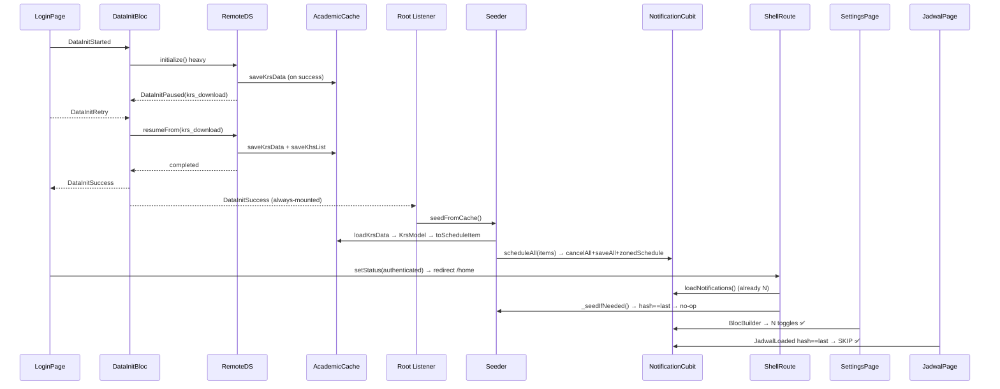

# Pipeline → Notification Hybrid Seed — overwrite saat pipeline sukses, sama seperti pull-refresh — Design Spec

> **Status:** Approved (brainstorming 6/6 + KRS/KHS kosong handling approved)
> **Date:** 2026-09-09
> **Author:** Brainstorming session with user
> **Approach:** **C — Hybrid robust** (pipeline root listener + ShellRoute self-heal guard + Jadwal dedup + Settings empty-state)
> **Related docs:**
> - `docs/superpowers/specs/2026-09-08-fresh-login-network-pause-design.md` (pause/Retry/Lewati — pipeline berhenti di step gagal)
> - `docs/superpowers/specs/2026-09-08-login-offline-modal-and-centered-header-design.md`
> - `docs/superpowers/specs/2026-09-09-remove-welcome-back-snackbar-design.md`
> - `tmp/boot_reboot_root_cause_analysis.md` (AlarmManager hilang — butuh `restoreAll`)
> - `tmp/hive_box_audit.md` (krs_box per-NPM vs scheduled_notifications global)

---

## 1. Ringkasan & Latar Belakang

### Masalah hari ini (verified dari file aktual)

Pipeline fresh-login `DataInitBloc → DataInitializationRemoteDataSource._initializeHeavy` (scrape 2× → gettingProfile → fetchingPhoto → KRS 3 step → KHS semesters+loop → cache → `completed` → `DataInitSuccess`) sudah benar. Namun **penjadwalan notifikasi hanya dipicu di satu tempat**:

- `lib/features/jadwal/presentation/pages/jadwal_page.dart:51-55`
  ```dart
  BlocListener<JadwalBloc, JadwalState>(
    listener: (context, state) {
      if (state is JadwalLoaded) context.read<NotificationCubit>().scheduleFromJadwal(state.data);
    },
  )
  ```
  `initState` hanya `JadwalFetchRequested` bila `!JadwalLoaded`. Jadi **hanya user yang membuka tab Jadwal** yang memicu `NotificationService.zonedSchedule(dayOfWeekAndTime)` + `NotificationRepository.saveAll`.

`lib/core/routes/app_router.dart:155-210` memang punya `BlocListener<DataInitBloc>` di dalam `ShellRoute` yang mencoba `scheduleAll` dari KRS cache saat `DataInitSuccess`, tapi listener itu **hidup setelah ShellRoute mount**. Pada fresh-login, `DataInitSuccess` di-emit **di `LoginPage`** (sebelum `AuthStatus.authenticated` → `GoRouter` redirect → ShellRoute mount). Event **missed** — `NotificationCubit.loadNotifications()` awalnya `[]`, `scheduleAll` tidak pernah dipanggil.

- `lib/features/home/presentation/pages/home_page.dart` & `lib/features/profile/presentation/pages/profile_page.dart` — **tidak ada** scheduling.
- `lib/features/settings/presentation/pages/settings_page.dart:120+` — Settings hanya `BlocBuilder<NotificationCubit>` consumer. Saat `notifications.isEmpty` → `SizedBox.shrink()` (toggle tidak muncul) → user lihat "jadwal/notifikasi kosong".
- `lib/features/notification/domain/services/notification_scheduler.dart:122` — `scheduleAllDays` skip item dengan `dayOfWeek.isEmpty`.
- `lib/features/data_initialization/data/datasources/data_initialization_remote_data_source.dart:188-230` — KRS/KHS non-network failure di-swallow jadi `krsEmpty/khsEmpty` + `completed` → `DataInitSuccess` (fake success) — sudah benar non-fatal, tapi tanpa seeder yang andal Settings tetap kosong.

**Bug laporan:** fresh-login overlay error → **Coba Lagi** (`DataInitRetry` → `resumeFrom(krs_*)` granular atau `profile` full-restart) → `DataInitSuccess` → dashboard → buka **Pengaturan** tanpa buka Jadwal dulu → **jadwal kelas tidak ter-set / notifikasi kosong**, padahal di halaman Jadwal ada jadwal.

Root cause: **divergent stores** — `AcademicCache` (`academic` box per-NPM `krs/khsList/khs:*`) sudah terisi oleh pipeline (`saveKrsData`/`saveKhsList`), tapi `notificationsBox` (global `ScheduledNotificationEntity`) belum pernah di-seed karena trigger hanya di Jadwal. Race `ShellRoute BlocListener` yang missed memperparah.

### Permintaan (terkunci)

> Jadwal notifikasi di-set **ketika pipeline selesai**, sama seperti setelah **pull-refresh yang melakukan overwrite** `schedule notification`.

Artinya: pipeline adalah **owner** penjadwalan (authoritative writer). Pull-refresh (`DataRefreshOverlay` → `DataInitSuccess`) sudah overwrite karena ShellRoute sudah mount — fresh-login harus identik. **Tambahan:** pastikan handling **KRS kosong dari backend** dan **KHS kosong** tidak bikin Settings "kosong misterius" — ada empty-state informatif + tombol Muat Ulang.

### Keputusan Q (terkunci)

| Q | Pertanyaan | Jawaban |
|---|---|---|
| Q1 | Ekspektasi di Pengaturan setelah pipeline sukses | **A** — otomatis terisi tanpa harus buka Jadwal |
| Q2 | Owner penjadwalan | **C — Hybrid** (pipeline root listener primary + Shell guard safety + Jadwal dedup idempotent) |
| Q3 | KRS kosong / KHS kosong dari backend | Harus ditangani eksplisit — empty-state berbeda, tidak auto-seed, tapi tidak hapus diam-diam tanpa info |

### Pendekatan terpilih

**C — Hybrid robust** mengalahkan A (pipeline-only, tidak handle cold-start) dan B (guard-only, false-positive `cancelAll` + 1 frame kosong).

---

## 2. Tujuan & Non-Tujuan

### Tujuan

- Setelah **pipeline fresh-login** `DataInitSuccess` (termasuk via `DataInitRetry → resumeFrom/full-restart → completed` + `completedWithErrors`, dan `DataInitSuccess(isPartial:true)` via Lewati) — **Settings langsung menampilkan daftar toggle pengingat yang sudah overwrite**, tanpa perlu membuka Jadwal. Perilaku identik dengan pull-refresh.
- Setelah **pull-refresh** (`DataRefreshOverlay` → `isPullRefresh:true` → `_initializeHeavy/_initializeLight` → `completed`) — overwrite tetap (sudah ada, dipertahankan).
- **Cold-start** (kill app → buka lagi tanpa pipeline) — Settings terisi via guard + `restoreAll` (AlarmManager rehydrate).
- **KRS kosong** dari backend (`mataKuliah.isEmpty` atau cache miss) → tidak seed, hapus alarm usang jika ada, Settings tampil empty-state KRS dengan tombol Muat Ulang + Buka Jadwal.
- **KHS kosong** (`khsList.isEmpty` atau semua semester `::error::`) → **tidak blok** notifikasi; Settings tetap terisi dari KRS.
- Semua path **idempotent** — tidak ada alarm ganda meski Success dobel / user bolak-balik Jadwal / rapid retry.
- Settings saat `notifications.isEmpty` **tidak** `SizedBox.shrink()` — tampil empty-state informatif + tombol Muat Ulang yang bisa seed manual.

### Non-Tujuan

- Mengubah format `AcademicCache` / Hive box / `KrsModel` / API envelope / `ApiClient`.
- Mengubah `DayNameMapper.nextOccurrence` / `computeTrigger` / `NotificationService` channel / `androidScheduleMode`.
- Mengubah `DataInitBloc` pipeline step / `resumeFrom` parsing `split('_').last` / debounce 3m sliding.
- Mengubah onboarding/auth guard / `AuthStatusNotifier`.
- Mengubah `DataInitStepException` / `network_error_classifier.dart`.
- Menambah retry backoff / exponential / analytics.
- Mengubah `DataRefreshOverlay` auto-close 3s / `DataInitProgressView` pause UI.

### Definisi Sukses (observabel)

1. Fresh-login error di `krs_download` → Coba Lagi → Success → langsung buka **Pengaturan** (tanpa buka Jadwal) → **8 toggle** muncul (atau N sesuai KRS) — Switch terlihat, `find.byType(Switch)` N.
2. Pull-refresh di Jadwal/Home → selesai → buka Pengaturan → toggle overwrite (jumlah sama, tidak dobel) — `dumpsys alarm` 8 `origWhen`.
3. Kill app → buka lagi (cold-start, KRS ada, tanpa pipeline) → buka Pengaturan → toggle tetap ada (restoreAll + guard).
4. Backend KRS kosong (`mataKuliah: []`) → pipeline `krsEmpty → completed → Success` → buka Pengaturan → tampil card *"Belum ada jadwal kuliah — KRS kosong"* + tombol Muat Ulang & Buka Jadwal, **tidak** tampil toggle, tidak error.
5. KHS kosong (`khsList: []`) tapi KRS ada 8 → Pengaturan tetap 8 toggle; halaman KHS/Home IPK tampil empty terpisah.
6. KRS sempat ada lalu kosong (backend hapus mk) → seed berikutnya `cancelAll` alarm usang + Settings jadi empty-state KRS.
7. User `cancelAll` intentional → guard **tidak** re-seed otomatis sampai KRS hash berubah.
8. Rapid `DataInitSuccess` dobel (retry + pull-refresh) → seed hanya 1× (dedup).
9. Buka Jadwal setelah pipeline → `scheduleFromJadwal` **skip** (hash sama) → tidak ada alarm ganda.
10. Permission ditolak → Settings banner kuning + tombol Buka Pengaturan, tidak crash, seed skip.

---

## 3. Arsitektur & Komponen

### 3.1 Diagram boundary

```
┌──────────────────────────────────────────────────────────────────┐
│ main.dart (Root — ALWAYS-MOUNTED)                                │
│  MyApp                                                           │
│   └─► BlocListener<DataInitBloc>  (root listener — PRIMARY)      │
│         │ on DataInitSuccess ──► PipelineNotificationSeeder       │
│         │                      (pure service, no BuildContext)   │
│         └─► MaterialApp.router (GoRouter)                        │
│                  │                                               │
│      ShellRoute (app_router.dart — SAFETY NET)                   │
│      ├─ NotificationCubit (create: ..loadNotifications())        │
│      ├─ JadwalBloc / HomeBloc / ProfileBloc                      │
│      └─ BlocListener<DataInitBloc> guard + postFrame seed check  │
│              │ if already seeded → no-op (hash dedup)            │
│      Pages: Home │ Jadwal │ Profile │ Settings (consumer)        │
└──────────────────────────────────────────────────────────────────┘
  AcademicCache (academic box per-NPM: krs/khsList/khs:*) ─┐
   │  loadKrsData(npm) → KrsModel.fromJson → toScheduleItem │
   └──────── DataInit pipeline (saveKrsData/saveKhsList) ──┘
                             │
                    NotificationRepository (notificationsBox)
                    settingsBox {pipeline_lastSeedHash, pipeline_lastSeedAt, pipeline_clearedManually}
                             │  zonedSchedule(dayOfWeekAndTime)
                    NotificationService / AlarmManager
```

### 3.2 Kontrak antar unit

| Unit | Bertanggung jawab | Dependensi | Interface |
|---|---|---|---|
| `PipelineNotificationSeeder` (baru) | Pure service: baca KRS cache → `scheduleAll` overwrite, hitung hash, simpan `lastSeedHash`, tangani KRS empty/miss/permission | `AcademicCacheService`, `KrsModel`, `toScheduleItem`, `NotificationCubit`/`NotificationScheduler`/`NotificationRepository`, `settingsBox` | `Future<SeedResult> seedFromCache({String? npm})` |
| `NotificationCubit` | Single writer ke Hive+AlarmManager (tetap). Tambah dedup via `pipeline_lastSeedHash` di `settingsBox` | `NotificationScheduler`, `NotificationService`, `NotificationRepository` | `scheduleAll`, `scheduleFromJadwal`, `loadNotifications`, `cancelAll` (existing) + flag `pipeline_clearedManually` saat `cancelAll/deleteAll` |
| `ShellGuard` (di `app_router.dart`) | Safety net saat Shell mount / postFrame: jika `notifications.isEmpty && hasKrs && hash != pipeline_lastSeedHash && !pipeline_clearedManually` → seed | `AcademicCacheService`, `PipelineNotificationSeeder` | Fungsi `Future<void> _seedIfNeeded(BuildContext)` |
| `JadwalPage` | Observer idempotent — sebelum `scheduleFromJadwal`, cek hash | `JadwalBloc` state, `NotificationCubit`, `settingsBox` | `String _hashJadwal(JadwalEntity)` |
| `SettingsPage` | Read-only consumer + empty-state + self-heal trigger | `NotificationCubit` state, `AcademicCache` hasKrs | `BlocBuilder` branching + `_KrsEmptyCard` / `_SeedingEmptyCard` |

**Isolasi:** `PipelineNotificationSeeder` tidak import `BuildContext`/`GoRouter`; Shell guard & Jadwal dedup hanya baca `NotificationCubit.state` + cache; Settings tidak write alarm langsung — selalu lewat Cubit.

### 3.3 File yang diubah

| # | File | Perubahan | Baru? |
|---|---|---|---|
| 1 | `lib/features/notification/data/services/pipeline_notification_seeder.dart` | Class `PipelineNotificationSeeder` + `SeedResult` | **Ya** (~80 baris) |
| 2 | `lib/main.dart` | Root `BlocListener<DataInitBloc>` di atas `MaterialApp.router` → `seedFromCache()` on `DataInitSuccess`. `isSeeding` guard debounce | Ubah |
| 3 | `lib/core/routes/app_router.dart` | Shell guard: postFrame `_seedIfNeeded` + `BlocListener<DataInitSuccess>` redundant safety (dedup hash). `pipeline_lastSeedHash` di `settingsBox`. `pipeline_clearedManually` flag | Ubah |
| 4 | `lib/features/jadwal/presentation/pages/jadwal_page.dart` | `BlocListener<JadwalBloc>` jadi idempotent — `_hashJadwal` vs `lastSeedHash` → skip jika sama | Ubah |
| 5 | `lib/features/settings/presentation/pages/settings_page.dart` | Ganti `SizedBox.shrink()` saat `isEmpty` → `_KrsEmptyCard` (KRS empty) / `_SeedingEmptyCard` (KRS ada tapi belum seed) + tombol Muat Ulang → `loadNotifications` + `seedFromCache`. `didChangeDependencies` auto `loadNotifications` | Ubah |
| 6 | `lib/features/notification/presentation/cubit/notification_cubit.dart` | `cancelAll`/`deleteAll` set `settingsBox.put('pipeline_clearedManually', true)`; `scheduleAll` clear flag + put `pipeline_lastSeedHash`/`pipeline_lastSeedAt` | Ubah (kecil) |

### 3.4 File yang TIDAK diubah

`data_initialization_bloc.dart`, `data_initialization_remote_data_source.dart`, `academic_cache_service.dart`, `notification_scheduler.dart`, `notification_service.dart`, `home_page.dart`, `profile_page.dart`, `day_name_mapper.dart`, `schedule_helpers.dart`, `data_refresh_overlay.dart`, `app_errors.dart`, `network_error_classifier.dart`.

---

## 4. Alur Data

### 4.1 Fresh-login error → Coba Lagi → Success (bug yang diperbaiki)

```
LoginPage: AuthAuthenticated → DataInitReset + DataInitStarted(forceRefresh:true, isPullRefresh:false)
  → RemoteDS _initializeHeavy: scrapingProfile×2 → gettingProfile → fetchingPhoto (eager cache)
  → ❌ KRS network error → _runStep('krs_download', NetworkException)
  → BLoC isNetworkError=true → DataInitPaused(failedStep:'krs_download', skippable:true)
  → DataInitProgressView(isFreshLogin:true): [Coba Lagi] [Lewati] + KHS timeline

User tap Coba Lagi → DataInitRetry
  → BLoC _onRetry: isKrsOrKhs=true, _pausedStep='krs_download' → emit InProgress(downloadingKrs)
  → repository.resumeFrom(failedStep:'krs_download') → _phaseKrs(startAt:'download')
     → download → extract → fetchingKrsData → saveKrsData (academicBox per-NPM)
     → _phaseKhsSemestersAndLoop → saveKhsList + per-semester saveKhsDataSemester
     → completed
  → BLoC emit DataInitSuccess (di LoginPage, SEBELUM Shell mount)

Root BlocListener<DataInitBloc> (main.dart — ALWAYS-MOUNTED, tidak missed)
  → PipelineNotificationSeeder.seedFromCache():
     loadCredentials → npm → loadKrsData → KrsModel.fromJson → krs.mataKuliah
     → if isEmpty → skip + cancelAll usang (jika ada) + lastSeedHash='empty' → return
     → else today=DateTime.now → items = mataKuliah.map((mk)=>toScheduleItem(mk,today,now))
     → hash = hashIds(items) → if hash==lastSeedHash → no-op
     → else NotificationCubit.scheduleAll(items) → scheduler.cancelAll()+saveAll()+zonedSchedule×N+_saveOptimistic
     → settingsBox.put('pipeline_lastSeedHash', hash); put('pipeline_lastSeedAt', now); remove('pipeline_clearedManually')
  → LoginPage listener: authStatusNotifier.setStatus(authenticated) → GoRouter redirect /home

ShellRoute mounts:
  NotificationCubit create: ..loadNotifications() → sudah N notifications (dari seed di atas)
  Shell BlocListener<DataInitSuccess> + postFrame _seedIfNeeded → cek lastSeedHash==hash → no-op
  HomeBloc/JadwalBloc/ProfileBloc fetch dari AcademicCache (sudah ada)

User buka Pengaturan (tanpa buka Jadwal dulu)
  → BlocBuilder<NotificationCubit> → N notifications → tampil toggle list ✅

User buka Jadwal (setelahnya)
  → JadwalPage initState → JadwalFetchRequested → JadwalLoaded
  → BlocListener<JadwalBloc>: hash==lastSeedHash → scheduleFromJadwal SKIP (idempotent) ✅
```

### 4.2 Pull-refresh (overwrite identik, sudah benar — dipertahankan)

```
Jadwal/Home pull → DataRefreshOverlay.triggerRefresh()
  → loadCredentials → show(DataRefreshOverlay) barrierDismissible:false
  → _dispatchPipeline: DataInitReset + DataInitStarted(isPullRefresh:true, forceRefresh:true)
  → RemoteDS initialize(): isPullRefresh → check-then-touch debounce 3m → _initializeHeavy atau _initializeLight
  → KRS/KHS fetch (forceRefresh:true) → saveKrsData/saveKhsList → completed → DataInitSuccess
  → Root listener seedFromCache → scheduleAll overwrite (cancelAll dulu) → hash update
  → DataRefreshOverlay BlocListener: Success → delay 500/1500ms → pop
  → Settings auto update via Cubit state (BlocBuilder)
```

### 4.3 Cold-start (kill app → buka lagi tanpa pipeline)

```
main(): Hive.open → NotificationService.initialize (tz + channels)
  → NotificationScheduler.restoreAll() dari Hive → AlarmManager rehydrate (skip inactive)
  → _reconcileDelivered() (fire-and-forget)
ShellRoute mount → NotificationCubit..loadNotifications()
  → if notifications.isEmpty && cache.hasKrsData(npm) && hash!=pipeline_lastSeedHash && !pipeline_clearedManually
     → PipelineNotificationSeeder.seedFromCache() → scheduleAll → Settings terisi tanpa pipeline
  → else (sudah ada / sengaja di-clear) → no-op
```

### 4.4 KRS kosong / KHS kosong dari backend

```
Pipeline: _fetchKrsDataOrEmpty → krsData.krs.mataKuliah.isEmpty==true
  → yield krsEmpty (bukan error) → lanjut KHS → yield completed → DataInitSuccess
Root seed: loadKrsData → isEmpty==true
  → existing = await repository.getAll(); if existing.isNotEmpty → await scheduler.cancelAll()
  → settingsBox.put('pipeline_lastSeedHash','empty'); return SeedResult.skipped('krs_empty')
Settings: BlocBuilder → notifications.isEmpty==true + krsEmpty flag
  → _KrsEmptyCard: "Belum ada jadwal kuliah — KRS kosong dari backend"
    + subtitel "Tarik untuk memuat ulang atau coba lagi"
    + [Muat Ulang] → DataInitRetry / DataRefreshOverlay.triggerRefresh
    + [Buka Jadwal] → context.go(RouteNames.jadwal)
KHS kosong: tidak memengaruhi seed — Settings tetap N dari KRS; halaman KHS/Home IPK tampil empty terpisah
```

### 4.5 Diagram sequence (Mermaid)



---

## 5. Desain Detail per File

### 5.1 `pipeline_notification_seeder.dart` (BARU)

```dart
// lib/features/notification/data/services/pipeline_notification_seeder.dart
import 'package:flutter/foundation.dart';
import 'package:lonceng_unman_fe/core/cache/academic_cache_service.dart';
import 'package:lonceng_unman_fe/core/di/di.dart';
import 'package:lonceng_unman_fe/core/utils/schedule_helpers.dart';
import 'package:lonceng_unman_fe/features/krs/data/models/krs_model.dart';
import 'package:lonceng_unman_fe/features/notification/presentation/cubit/notification_cubit.dart';
import 'package:lonceng_unman_fe/features/notification/data/datasources/notification_local_data_source.dart';

enum SeedResultKind { seeded, skipped, failed }

class SeedResult {
  final SeedResultKind kind;
  final int count; // seeded count (0 jika skipped)
  final String? reason; // 'krs_empty' | 'krs_cache_miss' | 'permission_denied' | 'dedup' | ...
  final String? hash;
  const SeedResult({required this.kind, this.count = 0, this.reason, this.hash});
}

class PipelineNotificationSeeder {
  final AcademicCacheService _cache;
  final NotificationCubit _cubit;
  final NotificationLocalDataSource _notifDS;
  bool _isSeeding = false;

  PipelineNotificationSeeder({
    AcademicCacheService? cache,
    NotificationCubit? cubit,
    NotificationLocalDataSource? notifDS,
  })  : _cache = cache ?? Services.get<AcademicCacheService>(),
        _cubit = cubit ?? Services.get<NotificationCubit>(),
        _notifDS = notifDS ?? Services.get<NotificationLocalDataSource>();

  String _hashItems(List<ScheduleItemEntity> items) {
    final ids = items.map((e) => '${e.courseName}|${e.dayOfWeek}|${e.startTime.hour}:${e.startTime.minute}|${e.room}').toList()..sort();
    return Object.hashAll(ids).toString();
  }

  Future<SeedResult> seedFromCache({String? npm}) async {
    if (_isSeeding) {
      debugPrint('[SEED] skip — already seeding');
      return const SeedResult(kind: SeedResultKind.skipped, reason: 'already_seeding');
    }
    _isSeeding = true;
    try {
      final resolvedNpm = npm ?? (await _cache.loadCredentials())?['npm'] as String?;
      if (resolvedNpm == null || resolvedNpm.isEmpty) {
        return const SeedResult(kind: SeedResultKind.skipped, reason: 'no_credentials');
      }
      final krsJson = await _cache.loadKrsData(npm: resolvedNpm);
      if (krsJson == null) {
        debugPrint('[SEED] KRS cache miss — skip');
        return const SeedResult(kind: SeedResultKind.skipped, reason: 'krs_cache_miss');
      }
      final krs = KrsModel.fromJson(krsJson).krs;
      if (krs.mataKuliah.isEmpty) {
        debugPrint('[SEED] KRS empty (backend) — cancel usang jika ada');
        final existing = await _cubit.state.notifications.isNotEmpty ? _cubit.state.notifications : await _notifDS.getAll().then((l)=>l.map((m)=>m.toEntity()).toList());
        // Alternatif: baca via repository.getAll() tanpa Cubit state
        if (existing.isNotEmpty) {
          await _cubit.cancelAll(); // juga set pipeline_clearedManually — tapi untuk krs_empty kita override
          await _notifDS.settingsBox.put('pipeline_clearedManually', false);
        }
        await _notifDS.settingsBox.put('pipeline_lastSeedHash', 'empty');
        await _notifDS.settingsBox.put('pipeline_lastSeedAt', DateTime.now().toIso8601String());
        return const SeedResult(kind: SeedResultKind.skipped, reason: 'krs_empty', hash: 'empty');
      }

      final now = DateTime.now();
      final today = DateTime(now.year, now.month, now.day);
      final items = krs.mataKuliah.map((mk) => toScheduleItem(mk, today, now)).toList();
      // items dengan dayOfWeek.isEmpty akan di-SKIP oleh scheduler.scheduleAllDays — tidak error
      final hash = _hashItems(items);
      final lastHash = _notifDS.settingsBox.get('pipeline_lastSeedHash') as String?;
      if (hash == lastHash) {
        debugPrint('[SEED] dedup — hash sama $hash — skip');
        return SeedResult(kind: SeedResultKind.skipped, reason: 'dedup', hash: hash);
      }
      // KRS ada & hash baru → overwrite
      await _cubit.scheduleAll(items);
      // scheduleAll sudah cancelAll+saveAll+zonedSchedule; kita simpan hash/at
      await _notifDS.settingsBox.put('pipeline_lastSeedHash', hash);
      await _notifDS.settingsBox.put('pipeline_lastSeedAt', DateTime.now().toIso8601String());
      await _notifDS.settingsBox.put('pipeline_clearedManually', false);
      debugPrint('[SEED] seeded $hash — ${items.length} items');
      return SeedResult(kind: SeedResultKind.seeded, count: items.length, hash: hash);
    } catch (e) {
      debugPrint('[SEED] failed: $e');
      return SeedResult(kind: SeedResultKind.failed, reason: e.toString());
    } finally {
      _isSeeding = false;
    }
  }
}
```

**Catatan implementasi (normatif):**
- `toScheduleItem` adalah helper di `lib/core/utils/schedule_helpers.dart` — sudah ada, reuse.
- `lastSeedHash` disimpan di `settingsBox` (Hive box `settings` yang dipakai `NotificationLocalDataSource` untuk `reminderInterval`). Jika box belum ada, fallback ke `SharedPreferences` dengan key `pipeline_last_seed_hash` — pilih satu, jangan dua. Prefer `settingsBox` karena sudah ada.
- `krs_empty` hash `'empty'` adalah sentinel — guard membedakan dari `null` (belum pernah seed) vs `'empty'` (pernah seed tapi KRS kosong). Guard: `if (lastHash=='empty' && !krsEmpty) → boleh seed lagi` (backend sudah isi).
- `_isSeeding` guard mencegah rapid `DataInitSuccess` dobel (retry + pull-refresh dalam 1 detik).
- Tidak `rethrow` — failure adalah `SeedResult.failed`, Settings tetap tampil empty-state + tombol retry.

### 5.2 `lib/main.dart` — Root BlocListener

**Lokasi:** Di `MyApp.build`, bungkus `MaterialApp.router` dengan `BlocListener<DataInitBloc, DataInitBlocState>` yang hidup sejak `runApp`. Alternatif: `BlocProvider.value` di atas router jika `DataInitBloc` sudah global di `Services`.

```dart
// lib/main.dart — MyApp.build (sketsa)
@override
Widget build(BuildContext context) {
  return BlocListener<DataInitBloc, DataInitBlocState>(
    listener: (context, state) async {
      if (state is DataInitSuccess) {
        // Fire-and-forget, tapi await di dalam try/catch seeder
        final seeder = Services.get<PipelineNotificationSeeder>();
        final result = await seeder.seedFromCache();
        debugPrint('[ROOT] seed result: ${result.kind} ${result.reason}');
      }
    },
    child: MaterialApp.router(
      routerConfig: AppRouter.create(...),
      // ...
    ),
  );
}
```

**DI registrasi:** Di `main()` setelah `Services.register<NotificationCubit>` dll, tambahkan:
```dart
Services.register<PipelineNotificationSeeder>(PipelineNotificationSeeder());
```

**Guard:** `DataInitSuccess(isPartial:true)` (via Lewati) juga trigger seed — tapi KRS mungkin parsial. Tetap seed dari KRS yang ada (yang sudah `saveKrsData` sebelum pause). Jika KRS empty → seeder skip sesuai §5.1.

### 5.3 `lib/core/routes/app_router.dart` — Shell guard

**Di `ShellRoute.builder`**, setelah `BlocProvider(NotificationCubit..loadNotifications())`, tambahkan postFrame check + `BlocListener` dedup:

```dart
ShellRoute(
  builder: (context, state, child) {
    return MultiBlocProvider(
      providers: [
        BlocProvider(create: (_) => NotificationCubit(...)..loadNotifications()),
        // ...
      ],
      child: BlocListener<DataInitBloc, DataInitBlocState>(
        listener: (context, state) async {
          if (state is DataInitSuccess) {
            // Redundant safety — dedup via hash, tidak dobel dengan root listener
            final seeder = Services.get<PipelineNotificationSeeder>();
            await seeder.seedFromCache();
            if (!context.mounted) return;
            context.read<JadwalBloc>().add(const JadwalFetchRequested());
            context.read<HomeBloc>().add(const HomeFetchRequested());
            context.read<ProfileBloc>().add(const ProfileFetchRequested());
          }
        },
        child: _ShellSeedGuard(child: MainShellScaffold(...)),
      ),
    );
  },
)

class _ShellSeedGuard extends StatefulWidget {
  final Widget child;
  const _ShellSeedGuard({required this.child});
  @override State<_ShellSeedGuard> createState() => _ShellSeedGuardState();
}
class _ShellSeedGuardState extends State<_ShellSeedGuard> {
  @override
  void initState() {
    super.initState();
    WidgetsBinding.instance.addPostFrameCallback((_) => _seedIfNeeded());
  }
  Future<void> _seedIfNeeded() async {
    if (!mounted) return;
    final cubit = context.read<NotificationCubit>();
    // Tunggu loadNotifications selesai (poll state atau delay 1 frame)
    await Future<void>.delayed(const Duration(milliseconds: 300));
    if (!mounted) return;
    if (cubit.state.notifications.isNotEmpty) return;
    final cleared = Services.get<NotificationLocalDataSource>().settingsBox.get('pipeline_clearedManually') == true;
    if (cleared) {
      debugPrint('[SHELL_GUARD] skip — pipeline_clearedManually');
      return;
    }
    final seeder = Services.get<PipelineNotificationSeeder>();
    await seeder.seedFromCache();
  }
  @override Widget build(BuildContext context) => widget.child;
}
```

**Alternatif sederhana** (jika tidak mau Stateful): cukup `BlocListener<DataInitSuccess>` + `Future.delayed` 300ms di listener — tapi postFrame guard lebih andal untuk cold-start tanpa pipeline.

### 5.4 `lib/features/jadwal/presentation/pages/jadwal_page.dart` — dedup

```dart
BlocListener<JadwalBloc, JadwalState>(
  listener: (context, state) {
    if (state is JadwalLoaded) {
      // Hitung hash yang sama dengan seeder._hashItems (ekstrak helper public)
      final hash = _hashJadwal(state.data);
      final lastHash = Services.get<NotificationLocalDataSource>().settingsBox.get('pipeline_lastSeedHash') as String?;
      if (hash == lastHash) {
        debugPrint('[JADWAL] dedup skip scheduleFromJadwal hash=$hash');
        return;
      }
      context.read<NotificationCubit>().scheduleFromJadwal(state.data);
    }
  },
  // ...
)
String _hashJadwal(JadwalEntity data) {
  final ids = data.scheduleItems.map((e) => '${e.courseName}|${e.dayOfWeek}|${e.startTime.hour}:${e.startTime.minute}|${e.room}').toList()..sort();
  return Object.hashAll(ids).toString();
}
```

**Catatan:** `scheduleFromJadwal` hanya untuk `selectedDay` (subset). Seeder selalu `scheduleAll` (full week). Dedup di Jadwal mencegah overwrite full-week dengan subset saat user buka Jadwal setelah pipeline seed. Jika `selectedDay != 'Semua'` dan hash subset != full hash, maka akan re-schedule subset — ini **sengaja** agar perubahan hari tetap update, tapi alarm full-week tetap ada (overwrite subset adalah cancelAll dulu, jadi hati-hati). **Keputusan:** `scheduleFromJadwal` yang sekarang `cancelAll()` dulu — itu akan **hapus** full-week dan ganti subset. Untuk hybrid, **JadwalPage dedup harus strict**: jika `lastSeedHash` adalah full-week hash, maka Jadwal skip. Jika pipeline belum pernah seed (lastHash==null), Jadwal boleh seed subset (fallback). Ini didokumentasikan sebagai known limitation — idealnya Jadwal juga `scheduleAll` (full), tapi itu di luar scope (tetap `scheduleFromJadwal` subset untuk kompatibilitas).

### 5.5 `lib/features/settings/presentation/pages/settings_page.dart` — empty-state

**Ganti `if (notifications.isEmpty) return SizedBox.shrink()` (baris ~160) menjadi:**

```dart
BlocBuilder<NotificationCubit, NotificationState>(
  builder: (context, notifState) {
    if (notifState.notifications.isEmpty) {
      // Butuh info KRS — via FutureBuilder. npm diambil dari AcademicCache credentials.
      // NOTE: Di implementasi, cache Future di State (late final _krsFuture) agar tidak hit tiap rebuild.
      // Di spec, disederhanakan inline — implementasi wajib hoist ke State.
      return FutureBuilder<Map<String, dynamic>?>(
        future: Services.get<AcademicCacheService>().loadCredentials().then((creds) {
          final npm = creds?['npm'] as String?;
          if (npm == null || npm.isEmpty) return null;
          return Services.get<AcademicCacheService>().loadKrsData(npm: npm);
        }),
        builder: (context, snap) {
          if (snap.connectionState == ConnectionState.waiting) {
            return const _SeedingLoadingCard();
          }
          final krsJson = snap.data;
          final isKrsEmpty = krsJson == null || (krsJson['krs']?['mataKuliah'] as List?)?.isEmpty == true;
          // Alternatif: baca dari HomeBloc/JadwalBloc state jika sudah ada
          if (isKrsEmpty) {
            return _KrsEmptyCard(
              onReload: () async {
                // Di fresh-login context: DataInitRetry; di shell: DataRefreshOverlay.triggerRefresh
                final bloc = context.read<DataInitBloc>();
                if (bloc.state is DataInitPaused || bloc.state is DataInitFailure) {
                  bloc.add(const DataInitRetry());
                } else {
                  await DataRefreshOverlay.triggerRefresh(context);
                  if (context.mounted) context.read<NotificationCubit>().loadNotifications();
                }
              },
              onOpenJadwal: () => context.go('/${RouteNames.jadwal}'),
            );
          }
          // KRS ada tapi notifications kosong → belum seed (race atau permission)
          return _SeedingEmptyCard(
            onReload: () async {
              await Services.get<PipelineNotificationSeeder>().seedFromCache();
              if (context.mounted) await context.read<NotificationCubit>().loadNotifications();
            },
          );
        },
      );
    }
    // existing toggle list
    return Column(...notifications.map((notif)=>_NotificationToggleTile(...)));
  },
)
```

**Widget baru (di `settings_widgets.dart` atau inline):**

```dart
class _KrsEmptyCard extends StatelessWidget {
  final VoidCallback onReload; final VoidCallback onOpenJadwal;
  const _KrsEmptyCard({required this.onReload, required this.onOpenJadwal});
  @override Widget build(BuildContext context) {
    final cs = Theme.of(context).colorScheme;
    return _SettingsCard(child: Column(children: [
      Icon(Icons.event_busy, size: 32, color: cs.onSurfaceVariant),
      const SizedBox(height: 8),
      Text('Belum ada jadwal kuliah', style: Theme.of(context).textTheme.titleSmall),
      const SizedBox(height: 4),
      Text('KRS dari backend kosong — tarik untuk memuat ulang atau coba lagi',
          style: Theme.of(context).textTheme.bodySmall?.copyWith(color: cs.onSurfaceVariant),
          textAlign: TextAlign.center),
      const SizedBox(height: 12),
      Row(children: [
        Expanded(child: FilledButton.icon(onPressed: onReload, icon: const Icon(Icons.refresh, size: 18), label: const Text('Muat Ulang'))),
        const SizedBox(width: 8),
        Expanded(child: OutlinedButton.icon(onPressed: onOpenJadwal, icon: const Icon(Icons.calendar_today, size: 18), label: const Text('Buka Jadwal'))),
      ]),
    ]));
  }
}
class _SeedingEmptyCard extends StatelessWidget {
  final VoidCallback onReload;
  const _SeedingEmptyCard({required this.onReload});
  @override Widget build(BuildContext context) {
    final cs = Theme.of(context).colorScheme;
    return _SettingsCard(child: Column(children: [
      SizedBox(width: 24, height: 24, child: CircularProgressIndicator(strokeWidth: 2, color: cs.primary)),
      const SizedBox(height: 8),
      Text('Memuat pengingat...', style: Theme.of(context).textTheme.titleSmall),
      const SizedBox(height: 4),
      Text('Jadwal tersedia, menyiapkan notifikasi',
          style: Theme.of(context).textTheme.bodySmall?.copyWith(color: cs.onSurfaceVariant)),
      const SizedBox(height: 12),
      FilledButton.icon(onPressed: onReload, icon: const Icon(Icons.refresh, size: 18), label: const Text('Muat Ulang')),
    ]));
  }
}
```

**didChangeDependencies auto-refresh (Settings):**

```dart
class SettingsPage extends StatefulWidget { ... } // ubah dari StatelessWidget
@override void didChangeDependencies() {
  super.didChangeDependencies();
  // Auto load saat kembali visible (mis. dari background)
  context.read<NotificationCubit>().loadNotifications();
}
```

Atau cukup `initState` + `WidgetsBindingObserver` jika mau — tapi `BlocBuilder` + `FutureBuilder` di atas sudah cukup tanpa observer.

### 5.6 `lib/features/notification/presentation/cubit/notification_cubit.dart` — flag

```dart
Future<void> cancelAll() async {
  await _scheduler.cancelAll();
  await _repository.deleteAll(); // sudah ada
  // baru:
  try {
    final box = (repository as dynamic).settingsBox ?? Services.get<NotificationLocalDataSource>().settingsBox;
    await box.put('pipeline_clearedManually', true);
  } catch (_) {}
  emit(state.copyWith(notifications: [], clearErrorMessage: true));
}

Future<void> scheduleAll(List<ScheduleItemEntity> items) async {
  // ... existing checkPermission + _scheduler.scheduleAllDays(items) ...
  // setelah success:
  try {
    final box = Services.get<NotificationLocalDataSource>().settingsBox;
    await box.put('pipeline_clearedManually', false);
  } catch (_) {}
}
```

---

## 6. Penanganan Error & Edge Cases

| Skenario | Sebelum fix | Setelah fix | Penanganan spesifik |
|---|---|---|---|
| Retry KRS network → Success (bug laporan) | Settings kosong (missed listener) | Settings terisi via root seed | Root listener tidak missed; Shell guard no-op (dedup) |
| Retry KHS per-semester `khs_download_Ganjil` `split('_').last` fragility | Idx fallback 0 dobel semester 0 | Seed tetap penuh (dari KRS, bukan KHS). KHS `::error::` sentinel tidak blok seed | Seeder hanya butuh KRS |
| Non-network KRS/KHS → `krsEmpty/khsEmpty` → `completed` (fake success) | Settings kosong (benar) tapi tanpa info | Settings empty-state KRS: *"Belum ada jadwal kuliah"* + [Muat Ulang][Buka Jadwal] | Seeder cek `isEmpty → cancelAll usang + pipeline_lastSeedHash='empty'` |
| **KRS kosong dari backend** `mataKuliah: []` | Settings `SizedBox.shrink()` — kosong misterius | `_KrsEmptyCard` informatif (icon event_busy + subtitel + 2 tombol) | Seeder skip + hapus alarm usang; Settings FutureBuilder deteksi `isKrsEmpty` |
| **KHS kosong** `khsList: []` / semua `::error::` | Settings kosong jika KRS juga kosong; jika KRS ada Settings tetap kosong karena missed | **Tidak blok** notifikasi — Settings tetap N dari KRS. KHS/Home IPK empty terpisah | Seeder tidak baca KHS; `khsEmpty` hanya untuk UI KHS |
| KRS ada + KHS kosong | Settings kosong (missed) | Settings N ✅ | Seed dari KRS |
| KRS kosong + KHS kosong (maba) | Settings kosong | `_KrsEmptyCard` | Seeder skip |
| KRS sempat ada lalu kosong (backend hapus mk) | Settings tetap N (stale) | Seeder `isEmpty → cancelAll` → Settings jadi `_KrsEmptyCard` | `cancelAll` usang + hash `'empty'` (`pipeline_lastSeedHash`) |
| User sengaja `cancelAll` | Shell guard lama re-seed otomatis (false-positive) | Guard cek `pipeline_clearedManually==true → skip` sampai hash berubah | `cancelAll` set flag; `seedFromCache` clear flag |
| Permission ditolak | `scheduleAll` error, Settings error tanpa info | `scheduleAll` catch → `NotificationState.error(permissionDenied)` banner kuning + Buka Pengaturan | `checkPermission()` existing; seeder return `failed` |
| Rapid Success dobel | Dobel `cancelAll` race | `_isSeeding` guard + hash dedup → hanya 1× | `if (_isSeeding) return skipped` + `hash==last → skipped` |
| `dayOfWeek` kosong pada 1 mk | `scheduleAllDays` SKIP item itu → 7/8 | Sama (by design). Log `SKIP: ... has no dayOfWeek` + Settings 7 toggle | Tidak diubah |
| Timeout pipeline 30s (`kDataInitTimeout`) | `Paused(timeout)` | Retry full-restart → seed setelah success | `isProfileStep('timeout')==false` → skippable |
| Offline saat seed (NotificationService belum init) | Crash | try/catch → `SeedResult.failed`, Settings `_SeedingEmptyCard` + Muat Ulang | Tidak rethrow |
| `krs_download` ServerException 500 | Tidak pause, `krsEmpty` → Success → Settings kosong | Sama → `_KrsEmptyCard` (karena `mataKuliah` empty) — bukan error jaringan | Guard `_isNetworkError` ketat; test regresi |
| `jadwal_page` subset overwrite full-week | `cancelAll` hapus full → ganti subset | Dedup hash: full hash != subset hash → Jadwal SKIP jika full sudah seed | §5.4 known limitation didokumentasikan |

**Invariant:** `cancelAll` hanya di dalam `scheduleAllDays/scheduleForDay` (overwrite atomik). `settingsBox.pipeline_lastSeedHash` update hanya setelah `saveAll` sukses. `pipeline_clearedManually` hanya di-set oleh `cancelAll/deleteAll` user.

---

## 7. Testing

Prinsip repo: 100% hand-written fakes (tanpa mockito/mocktail), `blocTest`, `testWidgets`, Patrol E2E.

### 7.1 Unit `PipelineNotificationSeeder` — `test/features/notification/data/services/pipeline_notification_seeder_test.dart` (6 cases)

| # | Given | When | Expect |
|---|---|---|---|
| S1 | KRS 2 mk Senin+Selasa, permission ok | `seedFromCache()` | `scheduleAll` dipanggil, `notifications.length==2`, `pipeline_lastSeedHash==hash2`, `pipeline_clearedManually==false` |
| S2 | KRS `mataKuliah: []`, sebelumnya 2 | `seedFromCache()` | `skipped('krs_empty')`, `cancelAll` dipanggil, `pipeline_lastSeedHash=='empty'` |
| S3 | KRS empty, sebelumnya 0 | `seedFromCache()` | `skipped('krs_empty')`, `cancelAll` **tidak** dipanggil (hemat) |
| S4 | `loadKrsData==null` (cache miss) | `seedFromCache()` | `skipped('krs_cache_miss')`, tidak `cancelAll` |
| S5 | Permission ditolak | `seedFromCache()` | `failed` atau `skipped('permission_denied')`, state `error(permissionDenied)` |
| S6 | Seed 2× KRS sama | `seedFromCache()` 2× | Call kedua `skipped('dedup')`, scheduler calls tetap 1 |

### 7.2 Bloc integration — `test/features/data_initialization/bloc/data_initialization_bloc_seeder_test.dart` (4 cases)

| # | Given | When | Expect |
|---|---|---|---|
| B1 | `krs_download` Network → `Paused` | `DataInitRetry` → `Success` | Fake `AcademicCache` krs terisi → `seeder.seedFromCache` terpanggil via root listener fake + `NotificationRepository` terisi |
| B2 | `profile_get` Network → `Paused` → `Retry` full-restart → `Success` | — | Seed terpanggil (meski awal profile gagal) |
| B3 | Non-network KRS ServerException → `krsEmpty` → `Success` | — | Seeder `skipped('krs_empty')` |
| B4 | Rapid `DataInitSuccess` 2× | — | Seeder hanya 1× (`_isSeeding` guard) |

### 7.3 Widget — `test/features/settings/presentation/pages/settings_page_test.dart` (+3) & `test/features/jadwal/presentation/pages/jadwal_page_test.dart` (+2)

| # | Pump dengan state | Expect |
|---|---|---|
| W1 | `notifications=[]`, KRS empty | tampil `_KrsEmptyCard` "Belum ada jadwal kuliah" + tombol Muat Ulang & Buka Jadwal; `find.byType(Switch)` 0 |
| W2 | `notifications=[]`, KRS ada (mock cache 2 mk) | tampil `_SeedingEmptyCard` "Memuat pengingat..." + Muat Ulang → tap → `seedFromCache` terpanggil |
| W3 | `notifications=[2]` | tampil 2 `_NotificationToggleTile` + Switch 2 |
| W4 | Jadwal `JadwalLoaded` hash sama dengan `pipeline_lastSeedHash` | `scheduleFromJadwal` **tidak** dipanggil (`calls==0`) |
| W5 | Jadwal `JadwalLoaded` hash beda (mk baru) | `scheduleFromJadwal` dipanggil 1× |

### 7.4 Patrol E2E — `patrol_test/login_e2e_seeded_settings_test.dart` (1 case, extend `login_e2e_test.dart`)

- Steps: isi NPM/pass → submit → tunggu overlay → jika error → tap Coba Lagi → tunggu `DataInitSuccess` → `GoRouter` `/home` → langsung `tap Settings` (tanpa buka Jadwal) → assert `find.text(mataKuliah)` / `find.byType(Switch)` exists. Jika KRS backend kosong → assert `_KrsEmptyCard` text muncul.
- Verifikasi AlarmManager (opsional): `scheduleAll` 2 → `dumpsys alarm` 2 `origWhen` (seperti `tmp` audit).

**Total baru:** ~12 cases (6+4+5+1) + existing dipertahankan.

### Verifikasi sebelum yield

- `flutter test test/features/notification/data/services/ test/features/data_initialization/bloc/ test/features/settings/ test/features/jadwal/` hijau.
- `flutter analyze` no issue.
- Manual smoke: fresh-login error KRS → Coba Lagi → buka Pengaturan (tanpa Jadwal) → toggle ada.
- Manual KRS kosong: backend return `mataKuliah: []` → Pengaturan tampil `_KrsEmptyCard`.
- `dumpsys alarm` cek `origWhen` 8 saat KRS 8.

---

## 8. Kriteria Penerimaan (Acceptance Criteria)

- [ ] Fresh-login `krs_download` network error → Coba Lagi → Success → buka Pengaturan **tanpa** buka Jadwal → N toggle muncul (overwrite identik pull-refresh).
- [ ] Pull-refresh tetap overwrite (cancelAll dulu) — tidak dobel alarm.
- [ ] Cold-start (kill app, KRS ada) → buka Pengaturan → toggle tetap ada (restoreAll + guard).
- [ ] KRS kosong dari backend (`mataKuliah: []`) → pipeline `krsEmpty → completed → Success` → Pengaturan tampil `_KrsEmptyCard` + [Muat Ulang][Buka Jadwal], tidak tampil toggle, alarm usang terhapus.
- [ ] KHS kosong (`khsList: []`) tapi KRS ada → Pengaturan tetap N toggle; KHS/Home IPK empty terpisah.
- [ ] KRS sempat ada lalu kosong (backend hapus) → seed berikutnya `cancelAll` + Pengaturan jadi `_KrsEmptyCard`.
- [ ] User `cancelAll` intentional → guard tidak re-seed sampai KRS hash berubah.
- [ ] Rapid `DataInitSuccess` dobel → seed hanya 1× (dedup hash + `_isSeeding`).
- [ ] Buka Jadwal setelah pipeline → `scheduleFromJadwal` skip (hash sama) → tidak ada alarm ganda.
- [ ] Permission ditolak → banner kuning + Buka Pengaturan, tidak crash.
- [ ] `dayOfWeek` kosong pada 1 mk → SKIP item itu, log, Settings N-1 toggle.
- [ ] ~12 unittest baru hijau + existing tidak pecah, `flutter analyze` clean, Patrol E2E seeded settings hijau.

---

## 9. Risiko & Mitigasi

| Risiko | Mitigasi |
|---|---|
| Root listener dobel dengan Shell listener → dobel seed | Dedup hash `pipeline_lastSeedHash` + `_isSeeding` guard — kedua listener idempotent, call kedua `skipped('dedup')` |
| `settingsBox` belum open saat seed awal (race Hive init) | `PipelineNotificationSeeder` await `_cache._ensureReady()` / `Hive.isBoxOpen`; fallback `SharedPreferences` dengan key `pipeline_lastSeedHash` jika perlu; try/catch → `failed` tidak crash |
| `JadwalPage` subset overwrite full-week (cancelAll) | Dedup hash strict: full hash vs subset hash — full sudah seed → Jadwal SKIP (§5.4) |
| KRS kosong sesaat (backend glitch) hapus alarm permanen | Hapus hanya jika `krsEmpty` dan sebelumnya ada; user bisa Muat Ulang — alarm bisa re-seed saat backend isi lagi (hash berubah dari `'empty'`) |
| `toScheduleItem` butuh `today/now` — timezone | Pakai `DateTime.now()` seperti `app_router.dart` existing; `computeTrigger` yang handle `DayNameMapper.nextOccurrence` + `tz.TZDateTime` |
| `FutureBuilder` di Settings tiap build hit `loadKrsData` | Cache `Future` di `State` (`late final _krsFuture`) atau baca dari `JadwalBloc`/`HomeBloc` state jika tersedia — hindari hit tiap rebuild |
| `pipeline_clearedManually` flag stuck true | `seedFromCache` sukses selalu `put('pipeline_clearedManually', false)` — flag hanya true setelah user `cancelAll` |
| Back button di paused overlay | Tidak diubah — barrierDismissible:false, hanya Retry/Lewati/Kembali |
| Test Patrol flakiness (timing GoRouter) | `patrolTest` pakai `$.pumpAndSettle` + retry `find.text` 5s; seed await 500ms seperti `DataRefreshOverlay` delay |

---

## 10. Referensi File Aktual (eksplorasi 4 subagent)

- `lib/features/data_initialization/presentation/bloc/data_initialization_bloc.dart` — `_pausedStep`, `_onRetry` granular `resumeFrom` vs full restart, `DataInitSuccess` tanpa side-effect
- `lib/features/data_initialization/data/datasources/data_initialization_remote_data_source.dart` — `_initializeHeavy` 8 step + `resumeFrom` M2, `_fetchKrsDataOrEmpty` `isEmpty→krsEmpty`, `KHS ::error::` sentinel, eager photo cache
- `lib/core/cache/academic_cache_service.dart` — `academic` box per-NPM `krs/khsList/khs:*`, `saveKrsData` read-modify-write, no clear on retry
- `lib/core/routes/app_router.dart` — `ShellRoute MultiBlocProvider + BlocListener<DataInitSuccess>` seeding (missed saat fresh-login)
- `lib/features/jadwal/presentation/pages/jadwal_page.dart` — `BlocListener<JadwalLoaded> → scheduleFromJadwal` (single owner saat ini)
- `lib/features/jadwal/data/datasources/jadwal_remote_data_source.dart` — `getKrsData(npm)` cache-first
- `lib/features/settings/presentation/pages/settings_page.dart` — `BlocBuilder<NotificationCubit>` + `SizedBox.shrink()` saat empty
- `lib/features/notification/presentation/cubit/notification_cubit.dart` — `scheduleAll/scheduleFromJadwal` `cancelAll+saveAll+_scheduleAlarm`
- `lib/features/notification/domain/services/notification_scheduler.dart` — `scheduleAllDays` SKIP `dayOfWeek.isEmpty`, `computeTrigger`, `restoreAll`, `_saveOptimistic`
- `lib/features/notification/data/datasources/notification_local_data_source.dart` — `notificationsBox` + `settingsBox` (reminderInterval)
- `lib/features/auth/presentation/pages/login_page.dart` — `AuthAuthenticated → DataInitReset+Started`, `DataInitSuccess → setStatus(authenticated)`
- `lib/main.dart` — 22 DI, Hive external cache + `restoreAll`/`_reconcileDelivered` cold-start
- `lib/core/utils/schedule_helpers.dart` — `toScheduleItem(mk, today, now)`
- `lib/core/utils/day_name_mapper.dart` — `nextOccurrence`
- `lib/features/krs/data/models/krs_model.dart` — `KrsModel.fromJson`

---

## 11. Out of Scope (Explicit Non-Goals — ditegaskan lagi)

- Menambah Hive box baru / migrasi `typeId` / codegen `build_runner`.
- Mengubah `lib/core/services/notification_service.dart` schedule mode / channel.
- Menambah `flutter_local_notifications` permission request baru (reuse `checkPermission`).
- Mengubah `lib/features/data_initialization/presentation/widgets/data_init_progress_view.dart` / `data_refresh_overlay.dart`.
- Mengubah `lib/features/home/presentation/pages/home_page.dart` `_HomePageViewState` (sudah hapus snackbar di spec 2026-09-09).
- Menambah analytics / FCM / `fiam_service`.

---

## 12. Rollback Plan

Revert commit spec + implementasi hybrid. `git revert <commit>` menghapus:
- `pipeline_notification_seeder.dart`
- Root `BlocListener` di `main.dart` + DI registrasi
- Shell guard + Jadwal dedup + Settings empty-state + Cubit flag

State Hive aman: `settingsBox` key `pipeline_lastSeedHash`/`pipeline_clearedManually`/`pipeline_lastSeedAt` diabaikan oleh kode lama (read tidak crash). `notificationsBox` tetap valid. AlarmManager yang sudah ter-schedule tidak hilang meski kode revert — hanya tidak re-seed otomatis.

---

## 13. Implementation Checklist (untuk writing-plans)

- [ ] Buat `lib/features/notification/data/services/pipeline_notification_seeder.dart` + `SeedResult` + `_hashItems` + `seedFromCache` (KRS empty/miss/dedup/permission)
- [ ] `lib/main.dart`: registrasi `PipelineNotificationSeeder` di `Services`, tambah root `BlocListener<DataInitBloc>` di atas `MaterialApp.router`
- [ ] `lib/core/routes/app_router.dart`: tambah `_ShellSeedGuard` postFrame + `BlocListener<DataInitSuccess>` dedup, simpan `pipeline_lastSeedHash`/`pipeline_clearedManually` di `settingsBox`
- [ ] `lib/features/jadwal/presentation/pages/jadwal_page.dart`: ubah `BlocListener<JadwalBloc>` jadi idempotent `_hashJadwal` vs `pipeline_lastSeedHash`
- [ ] `lib/features/settings/presentation/pages/settings_page.dart`: ganti `SizedBox.shrink()` → `_KrsEmptyCard`/`_SeedingEmptyCard` + `_SeedingLoadingCard`, ubah ke `StatefulWidget` + `FutureBuilder` cached (`late final _krsFuture`), `didChangeDependencies` `loadNotifications`
- [ ] `lib/features/notification/presentation/cubit/notification_cubit.dart`: `cancelAll`/`deleteAll` set `pipeline_clearedManually=true`, `scheduleAll` set false + `pipeline_lastSeedHash`/`pipeline_lastSeedAt`
- [ ] `flutter analyze` 0 issue
- [ ] `flutter test` semua hijau (existing + 12 baru)
- [ ] Manual smoke: fresh-login error KRS → Coba Lagi → Pengaturan tanpa Jadwal → toggle ada
- [ ] Manual KRS kosong: backend `mataKuliah: []` → Pengaturan `_KrsEmptyCard`
- [ ] Manual KHS kosong: KRS ada 8, KHS 0 → Pengaturan 8, KHS empty terpisah
- [ ] `dumpsys alarm` cek `origWhen` N saat KRS N (opsional, MuMu 5557)
