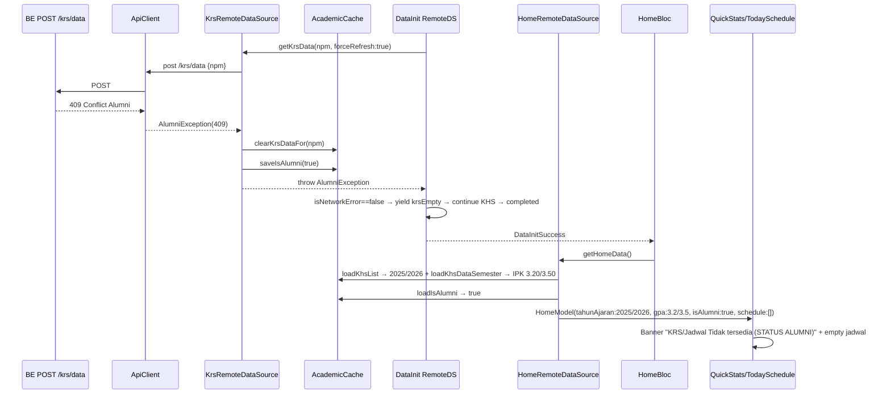

# Home KHS/Alumni Split — tahun ajaran & IPK dari KHS, Jadwal dari KRS + 409 ALUMNI handling — Design Spec

> **Status:** Draft — pending user review (brainstorming §1-§6 approved, Q1-Q5 terkunci A)
> **Date:** 2026-09-10
> **Author:** Brainstorming session with user
> **Approach:** **1 — Minimal split** (single-file HomeDS rewrite + Alumni flag + ApiClient 409)
> **Related docs:**
> - Investigasi 2026-09-10: Home `2026/2027` vs KHS `2025/2026 Genap` — campur aduk KRS/KHS (verified dari file aktual)
> - BE spec `POST /api/v1/lms/krs/data` 409 `ErrAlumniKRS` — `hasAlumniKRS()` scan `downloads/{npm}/krs/*ALUMNI*.pdf`
> - `docs/superpowers/specs/2026-09-09-pipeline-notification-seed-hybrid-design.md`

---

## 1. Ringkasan & Latar Belakang

### Masalah verified (dari file aktual — bukan asumsi)

**Campur aduk sumber di Home:**
- `lib/features/home/data/datasources/home_remote_data_source.dart:136` — `tahunAjaran: krsData?.periode.tahunAjaran ?? ''` — selalu dari **KRS aktif** (enrollment).
- `lib/features/home/data/datasources/home_remote_data_source.dart:62-84` — `gpaGanjil/Genap` load `KHS_GANJIL/GENAP` untuk `krsData.periode.tahunAjaran` itu, bukan untuk tahun KHS terbaru.
- `lib/features/home/presentation/pages/home_page.dart:172-174` + `lib/core/routes/app_router.dart:244` — `onKhsTap → /khs?tahunAjaran=data.tahunAjaran` mewarisi KRS.
- `lib/features/khs/data/datasources/khs_remote_data_source.dart:91-92` — `khsList` dari `POST /khs/semesters` adalah semester yang **sudah punya KHS** (selesai).
- `lib/features/khs/presentation/cubit/khs_detail_cubit.dart:406-429` + `year_picker_sheet.dart:17` — picker max dari `khsList`.

**Gejala user:** Home dashboard `Tahun Ajaran 2026/2027` (KRS depan) tapi masuk KHS picker hanya `2025/2026 Genap`. Tap `Lihat KHS` dari Home nge-push `2026/2027` yang kosong (`KhsDetailLoaded(ganjilData:null, genapData:null)` → empty state `Muat KHS 2026/2027`). IPK `0.00` karena tahun tidak ada.

**Tambahan BE — Alumni 409:**
`POST /api/v1/lms/krs/data` sekarang gate ALUMNI paling awal: scan `downloads/{npm}/krs/*.pdf` case-insensitive `*ALUMNI*.pdf` → jika ada → `409 Conflict` `apperror.ErrAlumniKRS` `"mahasiswa status ALUMNI — KRS tidak tersedia"` (mapping `extraction_handler.go` `errors.Is(ErrAlumniKRS) → Conflict` sebelum 404/500). `POST /krs` download tidak diubah. FE butuh: saat pull-refresh dapat 409 → jadwal **kosongkan sekarang** (hapus `krs` dari Hive), bukan retain cache lama; flag `isAlumni` live dari BE (409→true, 200/404/500→false, persist tapi overwrite tiap response).

### Permintaan terkunci (5 Q)

| Q | Pertanyaan | Jawaban |
|---|---|---|
| Q1 | `Tahun Ajaran` di Home dari mana? | **A — KHS terbaru** `max(khsList.tahunAjaran)`; kosong → `"-"` |
| Q2 | `IPK Ganjil/Genap` dari mana? | **A — ikut tahun KHS terbaru** (pair `GANJIL`+`GENAP` untuk `latestYear`) |
| Q3 | `khsList` kosong → Home? | **A — strict** `"-"` + `0.00`, jadwal tetap dari KRS |
| Q4 | `Lihat KHS` navigasi? | **A — ke tahun KHS terbaru** (`data.tahunAjaran` yang baru) |
| Q5.1 | 409 → cache KRS? | **A — hapus dari Hive sekarang** (`clearKrsDataFor(npm)`) |
| Q5.2 | Flag `isAlumni` persist? | **Backend saja, live** — tulis di Hive tiap response, tapi transient (overwrite) |
| Q5.3 | UX ALUMNI? | **Banner** `KRS/Jadwal Tidak tersedia (STATUS ALUMNI)` + jadwal empty, tidak auto-redirect |

### Pendekatan terpilih

**1 — Minimal split** mengalahkan 2 (Resolver service, over-engineering untuk 1 consumer) dan 3 (Entity split `krsTahunAjaran/khsTahunAjaran`, churn besar). Diff terkecil, risiko rendah — cukup rewrite 1 datasource + 1 exception + cache flag + UI banner.

---

## 2. Tujuan & Non-Tujuan

### Tujuan

- `tahunAjaran` di Home = `max(khsList.tahunAjaran)` (strict, no KRS fallback). `khsList` kosong → `""` → entity `"-"` di UI. Picker KHS dan header Home konsisten satu tahun.
- `gpaGanjil` + `gpaGenap` = `KHS_<latestYear>_GANJIL/GENAP.rekapitulasi.ipk` (missing → `0.0`). Tetap 2 chip Ganjil/Genap seperti sekarang, hanya sumber tahunnya pindah.
- `semester` label di Home = `profile.semester ?? khsSemester(latestYear) ?? krs.semester ?? "-"` — pertahankan priority `StudentProfile` dulu (Q5 follow-up `ok` → keep existing, tapi `khsSemester` sekarang dari `latestYear`).
- `onKhsTap` otomatis KHS-aware karena `data.tahunAjaran` sudah dari KHS — tanpa ubah `home_page.dart`/`app_router.dart` routing.
- `jadwal` (`scheduleItems`, `nextClass`, `sksTaken`, `todayClassCount`) tetap dari **KRS cache** — tidak terpengaruh tahun KHS.
- `POST /krs/data 409 ALUMNI` → `AcademicCacheService` hapus `krs` untuk NPM itu **sekarang** + `isAlumni=true` persist; Home `isAlumni==true` → `scheduleItems=[]`, `sksTaken=0`, `nextClass=null`, banner ALUMNI. Saat BE sudah tidak 409 (next `200`/`404`/`500`) → `isAlumni=false` (transient).
- `HomeRemoteDataSourceImpl` tetap **cache-only** (tidak hit network). Writer `isAlumni` + `krs` adalah `KrsRemoteDataSourceImpl` (dipicu pipeline pull-refresh heavy). Home hanya reader flag.
- `ApiClient` map `409 → AlumniException(statusCode:409)` membedakan dari `ServerException(404/500)`.

### Non-Tujuan

- Mengubah `AcademicCache` box name / Hive `typeId` / codegen.
- Mengubah `KhsDetailCubit`/`YearPickerSheet`/`KhsDetailState` — tidak perlu.
- Mengubah `StudentProfile` model/entity.
- Mengubah `Pipeline` debounce 3m, `DataInitBloc` step, `resumeFrom`.
- Mengubah `Jadwal` page, `Profile`, `Notification`, `FCM/FIAM`.
- Mengubah `BE extractor` atau `downloads/` scan logic — FE hanya handle 409.
- Menambah analytics / auto-redirect ke KHS saat ALUMNI.

### Definisi Sukses (observabel)

1. `khsList = [2023/2024 GANJIL, 2024/2025, 2025/2026 Genap]` → Home header `Tahun Ajaran 2025/2026`, IPK pair dari `2025/2026 GANJIL+GENAP`, `Lihat KHS → /khs?tahunAjaran=2025/2026`.
2. `khsList = []` → Home `Tahun Ajaran -`, IPK `0.00`/`0.00`, jadwal tetap dari KRS (jika ada & bukan alumni), `Lihat KHS` push `""` → AppBar `KHS ` + picker `Belum ada tahun ajaran` — tidak crash.
3. `POST /krs/data → 200` → `isAlumni=false`, Home jadwal normal.
4. `POST /krs/data → 409` saat pull-refresh heavy (`forceRefresh:true`) → Hive `krs` terhapus untuk NPM itu, `isAlumni=true`, Home `scheduleItems=[]`, `sksTaken=0`, banner ALUMNI visible — **tidak** retain cache lama.
5. `POST /krs/data → 404/500` → `isAlumni=false` (flag clear), jadwal fallback cache existing (non-alumni, existing behavior).
6. Setelah 409, next pull-refresh dapat `200` → `isAlumni=false` + jadwal pulih (overwrite).
7. `flutter analyze` 0 issue, `flutter test` existing hijau (+ baru).

---

## 3. Arsitektur & Komponen

### 3.1 Diagram boundary

```
[BE] POST /krs/data {npm}
  ├─ 200 {krs:{periode:{tahunAjaran, semester}, mataKuliah:[], totalSks}}
  ├─ 409 Conflict {message:"Mahasiswa status ALUMNI — KRS tidak tersedia"}
  ├─ 404/500 ServerException
  └─ (POST /khs/semesters → {semesters:[{tahunAjaran, semester, sks}]})

[KrsRemoteDataSourceImpl] —— sole writer isAlumni + krs cache ——
  on 200: saveKrsData + saveIsAlumni(false) → return KrsModel
  on 409 AlumniException: clearKrsDataFor(npm) + saveIsAlumni(true) → rethrow
  on 404/500: saveIsAlumni(false) → rethrow (flag transient)

[AcademicCacheService] (Hive box "academic" per NPM)
  {krs: Map?, khsList: List, khs: Map<"$tahun_$sem"->Map>, isAlumni: bool}
  + saveIsAlumni / loadIsAlumni / clearKrsDataFor (per-NPM, bukan clearAll)

              ┌─ HomeRemoteDataSourceImpl (cache-only, READER) ─┐
              │ loadKhsList → _latestTahunAjaran()               │
              │ if latest != "" → loadKhsDataSemester(latest,    │
              │   GANJIL/GENAP) → gpaGanjil/gpaGenap             │
              │ loadIsAlumni(npm) → bool                         │
              │ if isAlumni → jadwal=[], nextClass=null, sks=0  │
              │ else loadKrsData → mataKuliah → scheduleItems    │
              └──────────────┬───────────────────────────────────┘
                             ↓ HomeModel(isAlumni, tahunAjaran, gpa.., schedule..)
[HomeBloc] → HomeLoaded(data) → HomePage → QuickStats + TodaySchedule + HeroCountdown

[Pipeline] DataInitializationRemoteDataSource (pull-refresh heavy)
  → _getKrs(npm, forceRefresh:true) → KrsDS (writer) → next HomeFetchRequested → reader flag baru
  Home pull-to-refresh TIDAK langsung hit KrsDS — lewat pipeline (existing)
```

### 3.2 Kontrak antar unit

| Unit | Tanggung jawab | Dependensi | Interface |
|---|---|---|---|
| `ApiClient` | Map `409 → AlumniException` (baru) | `app_errors.dart` | `Future<Map> post()` throws `AlumniException` untuk 409 |
| `AlumniException` | Semantic 409, `isAlumniError` predicate | `AppException` | `class AlumniException extends AppException {statusCode=409}` |
| `AcademicCacheService` | Per-NPM `isAlumni` bool + `clearKrsDataFor` | Hive `academic` box | `saveIsAlumni({npm, isAlumni})`, `loadIsAlumni({npm})→bool`, `clearKrsDataFor({npm})` |
| `KrsRemoteDataSourceImpl` | **Sole writer** `isAlumni`+`krs` — side-effect sebelum rethrow | `ApiClient`, `AcademicCacheService` | `getKrsData()` dengan try/catch 409 |
| `HomeRemoteDataSourceImpl` | **Reader** — strict split year/IPK vs jadwal | `AcademicCacheService`, `StudentProfileCacheService`, `KhsModel`, `KrsModel`, `schedule_helpers` | `getHomeData()` cache-only |
| `HomeEntity/Model` | Tambah `isAlumni` flag | — | `HomeEntity(isAlumni: bool = false)` |
| `QuickStats` + `HomePage` | Banner ALUMNI + empty schedule ALUMNI | `HomeEntity.isAlumni` | Conditional `if (data.isAlumni)` banner |
| `NotificationScheduler`/`Settings` | Tidak diubah — jadwal kosong ALUMNI otomatis kosongkan notifikasi via existing seeder (jika ada) | — | — |

**Isolasi:** `HomeDS` tidak import `ApiClient`/`GetKrs` — hanya cache. `KrsDS` tidak import `HomeDS`. Flag `isAlumni` per-NPM, tidak global.

### 3.3 File yang diubah

| # | File | Perubahan | Baru? |
|---|---|---|---|
| 1 | `lib/core/errors/app_errors.dart` | `AlumniException` (statusCode 409) + `isAlumniError` helper jika perlu | Ubah |
| 2 | `lib/core/network/api_client.dart` | `case 409: return AlumniException(...)` di `_mapError` | Ubah |
| 3 | `lib/core/cache/academic_cache_service.dart` | `saveIsAlumni`/`loadIsAlumni`/`clearKrsDataFor` per-NPM; key `isAlumni` di `existing` map | Ubah |
| 4 | `lib/features/krs/data/datasources/krs_remote_data_source.dart` | `getKrsData` writer flag — 409 clear+true, 200/404/500 false | Ubah |
| 5 | `lib/features/home/domain/entities/home_entity.dart` | `isAlumni` field (default false) + equals/hash | Ubah |
| 6 | `lib/features/home/data/models/home_model.dart` | Forward `isAlumni` | Ubah |
| 7 | `lib/features/home/data/datasources/home_remote_data_source.dart` | Rewrite `tahunAjaran`/`gpa`/`semester` strict KHS, reader `isAlumni`, jadwal empty jika alumni + helper `_latestTahunAjaran` | Ubah |
| 8 | `lib/features/home/presentation/widgets/quick_stats.dart` | Banner ALUMNI conditional | Ubah |
| 9 | `lib/features/home/presentation/pages/home_page.dart` | (opsional) ALUMNI subtitle di `TodaySchedule` empty; `DataRefreshOverlay` tidak diubah | Ubah (kecil) |
| 10 | `test/...` | `ApiClient 409`, `HomeDS` latest/IPK/alumni, `KrsDS` writer | Baru |

### 3.4 File yang TIDAK diubah

`student_profile_model.dart`, `khs_remote_data_source.dart`, `khs_detail_cubit.dart`, `year_picker_sheet.dart`, `khs_app_bar_title.dart`, `app_router.dart` (routing `tahunAjaran` otomatis KHS-aware), `jadwal_remote_data_source.dart`, `profile_*`, `notification_*`, `data_initialization_*` (pipeline sudah benar, hanya consumer KrsDS yang baru).

---

## 4. Alur Data

### 4.1 Normal — Home dengan khsList terisi

```
AcademicCache: khsList=[{tahunAjaran:2024/2025,GANJIL}, {2025/2026,GENAP}, {2023/2024,GANJIL}]
               krs={periode:{tahunAjaran:2026/2027, semester:GENAP}, mataKuliah:[...8], totalSks:20}
               isAlumni=false
HomeDS.getHomeData():
  npm = loadCredentials
  khsList = loadKhsList → _latestTahunAjaran → "2025/2026" (max by akhir year)
  tahunAjaran = "2025/2026"
  ganjilKhs = loadKhsDataSemester("2025/2026","GANJIL")?.rekapitulasi.ipk ?? 0.0  // 3.20
  genapKhs  = loadKhsDataSemester("2025/2026","GENAP")?.rekapitulasi.ipk ?? 0.0   // 3.50
  isAlumni = loadIsAlumni() → false
  krsData = KrsModel.fromJson(loadKrsData).krs  // 8 mk
  scheduleItems = filter hari ini + toScheduleItem + sort
  nextClass = _findNextClass(mk, today, now)
→ HomeModel(tahunAjaran:"2025/2026", gpaGanjil:3.20, gpaGenap:3.50, semester: profile.semester ?? khsSemester ?? krs.semester, isAlumni:false, sksTaken:20, scheduleItems:[...], nextClass:...)
QuickStats: "Tahun Ajaran 2025/2026" + IPK 3.20/3.50 + onKhsTap → /khs?tahunAjaran=2025/2026
```

### 4.2 khsList kosong

```
khsList = null or []
tahunAjaran = ""  → HomeModel → UI "Tahun Ajaran -"
gpaGanjil=0.0, gpaGenap=0.0
isAlumni=false (default)
krsData ada → jadwal normal
Lihat KHS → /khs?tahunAjaran="" → KhsDetailCubit("", loadAvailableYears→[], loadAll→ empty)
```

### 4.3 Pull-refresh → 409 ALUMNI (heavy)

```
User pull di Home → DataRefreshOverlay.triggerRefresh()
 → DataInitBloc DataInitStarted(isPullRefresh:true) → RemoteDS initialize() check-then-touch debounce
 → isPullRefresh heavy → _initializeHeavy:
    ... profile(2× scrape+get) + photo
    → KRS: _getKrs.download → extract → call getKrsData(npm, forceRefresh:true)
       → KrsDS.getKrsData → ApiClient.post('/krs/data') → 409
       → _mapError → AlumniException
       → KrsDS catch AlumniException:
          await clearKrsDataFor(npm)   // existing['krs'] removed, khs/isAlumni kept
          await saveIsAlumni(npm,true) // overwrite flag
          rethrow AlumniException
    → RemoteDS KRS catch non-network? AlumniException is AppException subtype of ServerException
       → isNetworkError(e) == false → non-fatal: yield krsEmpty, continue KHS
    → KHS: fetch semesters + loop download/extract/data (tetap jalan, KHS masih ada)
    → completed → DataInitSuccess
 → Root/Pipeline listener tidak relevan — ini pipeline itu sendiri
 → Next HomeBloc HomeFetchRequested (router + DataRefreshOverlay finalize):
    HomeDS.getHomeData():
      loadIsAlumni → true → scheduleItems=[], nextClass=null, sksTaken=0
      tahunAjaran tetap dari khsList (2025/2026), gpa tetap
 → Home Loaded isAlumni:true → banner ALUMNI + TodaySchedule empty ALUMNI
 → Hive: krs key hilang → next launch tetap alumni tanpa hit network (offline banner ALUMNI)
```

### 4.4 Setelah 409, next 200 — pemulihan

```
BE hapus ALUMNI pdf → next pull-refresh heavy:
  KrsDS.getKrsData → 200 {krs:{...}} → saveKrsData + saveIsAlumni(false) → return KrsModel
  RemoteDS KRS isEmpty check → if mataKuliah.isEmpty → krsEmpty else success
  HomeDS next fetch → isAlumni=false → loadKrsData → jadwal pulih
```

### 4.5 Non-ALUMNI error (404/500) — bukan alumni

```
ApiClient 404 → ServerException(404) → KrsDS catch AppException non-Alumni:
  await saveIsAlumni(false) // flag transient false — sesuai Q5.3 "jika tidak ada error alumni flag jadi false"
  rethrow ServerException
RemoteDS catch → isNetworkError==false → yield krsEmpty (existing non-fatal)
HomeDS next fetch → isAlumni=false → loadKrsData fallback cache (jika ada) → jadwal dari cache lama (existing)
```

### 4.6 Diagram sequence (Mermaid)



---

## 5. Desain Detail per File

### 5.1 `lib/core/errors/app_errors.dart`

```dart
class AlumniException extends AppException {
  const AlumniException(String message, {int statusCode = 409}) : super(message, statusCode: statusCode);
}

bool isAlumniError(Object e) => e is AlumniException || (e is AppException && e.statusCode == 409);
```

### 5.2 `lib/core/network/api_client.dart`

```dart
Future<AppException> _mapError(int statusCode, String message) async {
  switch (statusCode) {
    case 400: return ValidationException(message);
    case 401: ... AuthException ...
    case 403: return ServerException(message, statusCode: 403);
    case 404: return ServerException(message, statusCode: 404);
    case 409: return AlumniException(message, statusCode: 409); // BARU
    case 500: return ServerException(message, statusCode: 500);
    default: return ServerException(message, statusCode: statusCode);
  }
}
```

### 5.3 `lib/core/cache/academic_cache_service.dart`

```dart
static const _isAlumniKey = 'isAlumni'; // per-NPM, di existing map

Future<void> saveIsAlumni({required String npm, required bool isAlumni}) async {
  await _ensureReady();
  final raw = _academic.get(npm);
  final existing = raw != null ? Map<String, dynamic>.from(raw as Map) : <String, dynamic>{};
  existing[_isAlumniKey] = isAlumni;
  await _academic.put(npm, existing);
}

Future<bool> loadIsAlumni({required String npm}) async {
  await _ensureReady();
  final raw = _academic.get(npm);
  if (raw == null) return false;
  final data = raw as Map<dynamic, dynamic>;
  return data[_isAlumniKey] as bool? ?? false;
}

Future<void> clearKrsDataFor({required String npm}) async {
  await _ensureReady();
  final raw = _academic.get(npm);
  if (raw == null) return;
  final data = Map<String, dynamic>.from(raw as Map);
  data.remove('krs');
  await _academic.put(npm, data);
}
// clearKrsData() existing (clear untuk all users) tetap, tidak dihapus
```

### 5.4 `lib/features/krs/data/datasources/krs_remote_data_source.dart`

```dart
@override
Future<KrsModel> getKrsData({required String npm, bool forceRefresh = false}) async {
  if (!forceRefresh) {
    final cachedData = await academicCacheService.loadKrsData(npm: npm);
    if (cachedData != null) return KrsModel.fromJson(cachedData);
  }
  try {
    final response = await apiClient.post('/api/v1/lms/krs/data', body: {'npm': npm});
    await academicCacheService.saveKrsData(npm: npm, data: response);
    await academicCacheService.saveIsAlumni(npm: npm, isAlumni: false);
    return KrsModel.fromJson(response);
  } on AlumniException {
    // MUST be before AppException — AlumniException extends AppException
    await academicCacheService.clearKrsDataFor(npm: npm);
    await academicCacheService.saveIsAlumni(npm: npm, isAlumni: true);
    rethrow;
  } on AppException {
    // 404/500/403/network-wrapped — bukan alumni → flag false (transient, Q5.3)
    // clearKrsDataFor TIDAK dipanggil — hanya update flag
    try { await academicCacheService.saveIsAlumni(npm: npm, isAlumni: false); } catch (_) {}
    rethrow;
  }
}
```
Catatan: `downloadKrs`/`extractKrs` tidak diubah — gate hanya di `getKrsData` sesuai BE spec.

### 5.5 `lib/features/home/domain/entities/home_entity.dart` + `home_model.dart`

```dart
class HomeEntity {
  const HomeEntity({
    required this.userName,
    required this.avatarUrl,
    this.nextClass,
    required this.scheduleItems,
    required this.sksTaken,
    required this.todayClassCount,
    required this.semester,
    required this.tahunAjaran,
    required this.studyProgram,
    required this.gpaGanjil,
    required this.gpaGenap,
    this.isAlumni = false, // BARU, default false untuk compat
  });
  final bool isAlumni;
  @override bool operator == ...
  @override int get hashCode => Object.hash(..., isAlumni);
}
class HomeModel extends HomeEntity {
  const HomeModel({..., super.isAlumni = false});
}
```

### 5.6 `lib/features/home/data/datasources/home_remote_data_source.dart` — rewrite

```dart
Future<HomeModel> getHomeData() async {
  final creds = await academicCacheService.loadCredentials();
  final npm = creds?['npm'];
  if (npm == null || npm.isEmpty) throw const ValidationException(...);

  // 1. Tahun ajaran + IPK dari KHS — strict, no KRS fallback
  final khsList = await academicCacheService.loadKhsList(npm: npm);
  final latestYear = _latestTahunAjaran(khsList); // "" jika null/empty
  double gpaGanjil = 0.0, gpaGenap = 0.0;
  String? khsSemesterForLatest;
  if (latestYear.isNotEmpty) {
    try {
      final ganjilKhs = await academicCacheService.loadKhsDataSemester(npm: npm, tahunAjaran: latestYear, semester: 'GANJIL');
      if (ganjilKhs != null) { final d = KhsModel.fromJson(ganjilKhs).khs; gpaGanjil = d.rekapitulasi.ipk; khsSemesterForLatest ??= d.periode.semester; }
      final genapKhs = await academicCacheService.loadKhsDataSemester(npm: npm, tahunAjaran: latestYear, semester: 'GENAP');
      if (genapKhs != null) { final d = KhsModel.fromJson(genapKhs).khs; gpaGenap = d.rekapitulasi.ipk; khsSemesterForLatest ??= d.periode.semester; }
    } catch (_) {}
  }
  final tahunAjaran = latestYear; // "" → entity akan jadi "-" di UI

  // 2. isAlumni flag — reader only, tidak hit network
  final isAlumni = await academicCacheService.loadIsAlumni(npm: npm);

  // 3. Jadwal dari KRS — kosong paksa jika alumni
  List<ScheduleItemEntity> todaySchedule = const [];
  KrsDataEntity? krsData;
  int sksTaken = 0;
  NextClassEntity? nextClass;
  if (!isAlumni) {
    final krsJson = await academicCacheService.loadKrsData(npm: npm);
    if (krsJson != null) {
      try { krsData = KrsModel.fromJson(krsJson).krs; } catch (_) {}
    }
    if (krsData != null) {
      sksTaken = krsData.totalSks;
      final now = DateTime.now(); final today = DateTime(now.year, now.month, now.day);
      final todayDayName = weekdayToDayName(now.weekday);
      todaySchedule = krsData.mataKuliah.where((mk) => mk.hari == todayDayName).map((mk) => toScheduleItem(mk, today, now)).toList()..sort(...);
      nextClass = _findNextClass(krsData.mataKuliah, today, now);
    }
  } else {
    // ALUMNI: jadwal paksa kosong, sks 0, nextClass null — meski cache masih ada race
    todaySchedule = const []; nextClass = null; sksTaken = 0;
  }

  // 4. Profile override untuk userName/studyProgram/semester label
  String userName = krsData?.mahasiswa.nama ?? '';
  String studyProgram = krsData?.mahasiswa.programStudi ?? '';
  String semester = khsSemesterForLatest ?? krsData?.periode.semester ?? '';
  try {
    final profileJson = await studentProfileCacheService.loadProfile(npm: npm);
    if (profileJson != null) {
      final profile = StudentProfileModel.fromJson(profileJson);
      if (profile.namaMahasiswa.isNotEmpty) userName = profile.namaMahasiswa;
      if (profile.programStudi.isNotEmpty) studyProgram = profile.programStudi;
      if (profile.semester.isNotEmpty) semester = profile.semester; // keep existing priority: profile first
    }
  } catch (_) {}
  // Jika khsSemesterForLatest ada dan profile kosong, semester sudah dari KHS latest

  return HomeModel(
    userName: userName.isNotEmpty ? userName : 'Mahasiswa',
    avatarUrl: '',
    nextClass: nextClass,
    scheduleItems: todaySchedule,
    sksTaken: sksTaken,
    todayClassCount: todaySchedule.length,
    semester: semester.isNotEmpty ? semester : '-',
    tahunAjaran: tahunAjaran.isNotEmpty ? tahunAjaran : '', // QuickStats akan render '-' jika ""
    studyProgram: studyProgram.isNotEmpty ? studyProgram : '-',
    gpaGanjil: gpaGanjil,
    gpaGenap: gpaGenap,
    isAlumni: isAlumni,
  );
}

String _latestTahunAjaran(List<dynamic>? khsList) {
  if (khsList == null || khsList.isEmpty) return '';
  String? best; int bestAkhir = -1;
  for (final item in khsList) {
    if (item is! Map) continue;
    final ta = (item['tahunAjaran'] ?? item['tahun_ajaran']) as String?;
    if (ta == null || ta.isEmpty || !ta.contains('/')) continue;
    final parts = ta.split('/');
    final akhir = int.tryParse(parts.last.trim()) ?? -1;
    if (akhir > bestAkhir || (akhir == bestAkhir && (best == null || ta.compareTo(best) > 0))) {
      bestAkhir = akhir; best = ta;
    }
  }
  return best ?? '';
}
```

### 5.7 `lib/features/home/presentation/widgets/quick_stats.dart`

```dart
Widget build(BuildContext context) {
  final cs = Theme.of(context).colorScheme;
  return Column(children: [
    if (data.isAlumni)
      Container(
        width: double.infinity,
        margin: const EdgeInsets.only(bottom: AppDimens.space12),
        padding: const EdgeInsets.symmetric(horizontal: AppDimens.space12, vertical: AppDimens.space10),
        decoration: BoxDecoration(color: cs.errorContainer.withValues(alpha: 0.6), borderRadius: BorderRadius.circular(AppDimens.radiusLG)),
        child: Row(children: [
          Icon(Icons.school_outlined, size: AppDimens.iconSM, color: cs.onErrorContainer),
          const SizedBox(width: AppDimens.space8),
          Expanded(child: Text('KRS/Jadwal Tidak tersedia (STATUS ALUMNI)', style: TextStyle(fontSize: AppDimens.textSM, fontWeight: FontWeight.w600, color: cs.onErrorContainer))),
        ]),
      ),
    Row(children: [StatCard SKS, StatCard Kuliah Hari Ini]), // existing, sksTaken sudah 0 saat alumni
    const SizedBox(height: AppDimens.space12),
    Container( // Tahun Ajaran + IPK card — existing
      child: Column(children: [
        Text(tahunAjaran.isEmpty ? 'Tahun Ajaran -' : 'Tahun Ajaran $tahunAjaran'), // handle ""
        Row(children: [_buildIpkChip(Ganjil, gpaGanjil), _buildIpkChip(Genap, gpaGenap), Spacer(), Lihat KHS]),
      ]),
    ),
  ]);
}
```

### 5.8 `lib/features/home/presentation/pages/home_page.dart` — TodaySchedule empty ALUMNI

```dart
Widget _buildContent(...) {
  if (data.isAlumni && data.scheduleItems.isEmpty) {
    // ALUMNI empty state — ganti TodaySchedule dengan card ALUMNI
    // atau TodaySchedule tetap tapi dengan prop isAlumni untuk ubah title/subtitle
    // NOTE: Jangan throw di build — pure widget. isAlumni hanya ubah text.
  }
}
// Paling minimal: TodaySchedule sudah handle empty (homeEmptyClassTitle etc.)
// Untuk ALUMNI, tambah branch:
if (data.isAlumni) {
  // Tampilkan card kecil di atas atau ganti empty text:
  // "Jadwal tidak tersedia — Status ALUMNI, silakan cek KHS"
}
```

Implementasi minimal: `TodaySchedule` tambah param `isAlumni` opsional (default false) untuk ganti `homeEmptyClassTitle`/`Subtitle` saat alumni. Atau cukup `QuickStats` banner saja — HomePage tidak perlu ubah `TodaySchedule` jika banner sudah cukup. Spec: **banner di QuickStats + TodaySchedule empty ALUMNI optional** — implementor pilih.

---

## 6. Penanganan Error & Edge Cases

| Skenario | Sebelum fix | Setelah fix |
|---|---|---|
| `khsList` 3 tahun → header | `2026/2027` (KRS) | `2025/2026` (max khsList) ✅ |
| `khsList` empty | `2026/2027` (KRS) + IPK 0 | `"-"` + `0.00`, jadwal tetap dari KRS |
| `latestYear=2025/2026` tapi GANJIL missing | IPK Ganjil 0.00, Genap dari cache | Toleran — `try` per semester |
| `isAlumni=true` | Jadwal tetap dari KRS | `scheduleItems=[]`, `sksTaken=0`, banner ALUMNI |
| 409 saat pull-refresh heavy | Retain cache lama → jadwal stale | `clearKrsDataFor` → jadwal kosong konsisten |
| 404/500 KRS | `ServerException` + retain cache | `isAlumni=false` + retain cache (non-alumni, existing) |
| 200 setelah 409 | Tetap alumni | `isAlumni=false` + jadwal pulih |
| Offline `getHomeData` | Tampilkan KRS `2026/2027` | Tampilkan KHS `2025/2026` + flag ALUMNI persist (offline tetap benar) |
| `tahunAjaran` mix `tahun_ajaran` vs `tahunAjaran` | KRS pakai `tahun_ajaran`, KHS pakai `tahunAjaran` | Helper `_latestTahunAjaran` handle keduanya |
| `khsList` format lama `tahun_ajaran: {awal, akhir}` | Tidak ada di `khsList` (sudah normalized di KhsDS) | Normalized sudah `tahunAjaran: "2025/2026"` |
| `Lihat KHS` saat `khsList` empty | `2026/2027` (KRS) → empty tab | `""` → AppBar `KHS ` + picker `Belum ada tahun ajaran` + empty `Muat KHS ` |

**Invariant:** `HomeDS` tidak pernah write `isAlumni`/`krs`. `KrsDS` sole writer. `khsList` single source tahun ajaran.

---

## 7. Testing

### 7.1 Unit `ApiClient` — `test/core/network/api_client_alumni_test.dart`

| # | Input | Expect |
|---|---|---|
| A1 | `_mapError(409, "Mahasiswa status ALUMNI")` | `is AlumniException` + `statusCode 409` + `isAlumniError==true` |
| A2 | `404`/`500` | `ServerException`, `isAlumniError==false` |

### 7.2 Unit `AcademicCacheService` — `test/core/cache/academic_cache_alumni_test.dart`

| # | Given | When | Expect |
|---|---|---|---|
| C1 | saveIsAlumni(true) | loadIsAlumni | true |
| C2 | saveKrsData + saveIsAlumni(true) + clearKrsDataFor | loadKrsData | null; loadIsAlumni true; khsList tetap |
| C3 | Non-NPM lain | clearKrsDataFor(npm A) | NPM B tidak terhapus |

### 7.3 Unit `KrsRemoteDataSourceImpl` — `test/features/krs/data/datasources/krs_remote_alumni_test.dart`

| # | ApiClient | Expect |
|---|---|---|
| K1 | 409 mock | `throws AlumniException` + `clearKrsDataFor` called + `saveIsAlumni(true)` |
| K2 | 200 `{krs:{...}}` | `saveKrsData` + `saveIsAlumni(false)` + return KrsModel |
| K3 | 404 | `throws ServerException` + `saveIsAlumni(false)` |

### 7.4 Unit `HomeRemoteDataSourceImpl` — `test/features/home/data/datasources/home_remote_alumni_split_test.dart`

| # | Cache | Expect |
|---|---|---|
| H1 | `khsList=[2024/2025,2025/2026,2023/2024]` + `loadKhsDataSemester` GANJIL 3.2 GENAP 3.5 untuk `2025/2026` | `tahunAjaran==2025/2026`, `gpaGanjil==3.2`, `gpaGenap==3.5` |
| H2 | `khsList=[]` + `krs` ada 8 mk | `tahunAjaran==""`, `gpa 0/0`, `scheduleItems.length==todayCount`, `isAlumni==false` |
| H3 | `latest=2025/2026` tapi `GENAP` cache null | `gpaGenap==0.0`, tidak throw |
| H4 | `isAlumni=true` + `krs` ada 8 mk (stale race) | `scheduleItems==[]`, `sksTaken==0`, `nextClass==null`, `tahunAjaran` tetap `2025/2026` |
| H5 | `isAlumni=true` + `khsList empty` | `tahunAjaran==""`, `scheduleItems==[]`, `isAlumni==true` |
| H6 | `profile.semester=="6"` override | `semester=="6"` meski `khsSemester=="GENAP"` |

### 7.5 Widget — `test/features/home/presentation/widgets/quick_stats_alumni_test.dart`

| # | Pump | Expect |
|---|---|---|
| W1 | `HomeEntity(isAlumni:true)` | `find.text("KRS/Jadwal Tidak tersedia (STATUS ALUMNI)")` + `find.byIcon(Icons.school_outlined)` |
| W2 | `isAlumni:false` | Banner tidak ada |

### 7.6 Regression — existing `test/features/home` + `test/features/krs` tetap hijau

---

## 8. Kriteria Penerimaan (Acceptance Criteria)

- [ ] Home dengan `khsList` 3 tahun → header `2025/2026` (bukan `2026/2027` KRS), IPK pair dari `2025/2026`, `Lihat KHS → /khs?tahunAjaran=2025/2026`
- [ ] `khsList=[]` → Home `Tahun Ajaran -`, IPK `0.00`, jadwal dari KRS, `Lihat KHS` → picker `Belum ada tahun ajaran`
- [ ] `ApiClient 409 → AlumniException(409)`
- [ ] `KrsDS 409 → clearKrsDataFor + saveIsAlumni(true) → rethrow`
- [ ] `KrsDS 200/404/500 → saveIsAlumni(false)`
- [ ] `HomeDS isAlumni=true → scheduleItems=[]`, `sksTaken=0`, `nextClass=null`, banner ALUMNI visible
- [ ] Pull-refresh heavy 409 → Hive `krs` hilang, next Home fetch konsisten kosong (tidak retain)
- [ ] 200 setelah 409 → `isAlumni=false` + jadwal pulih
- [ ] `flutter analyze` 0 issue, `flutter test` hijau
- [ ] Manual: BE `downloads/{npm}/krs/*ALUMNI*.pdf` ada → pull-refresh → banner ALUMNI; hapus file → pull-refresh → banner hilang + jadwal pulih

---

## 9. Risiko & Mitigasi

| Risiko | Mitigasi |
|---|---|
| `khsList` format belum normalized (lama) | Helper handle `tahunAjaran` + `tahun_ajaran`, skip `!contains('/')` |
| `loadIsAlumni` sebelum Hive `initialize` | `_ensureReady()` di semua method; fallback `false` |
| `clearKrsDataFor` race dengan pipeline KRS `saveKrsData` | Writer tunggal `KrsDS`; pipeline heavy selalu `forceRefresh:true` → urut; HomeDS reader tidak write |
| `tahunAjaran=""` di `HomeModel` bikin `QuickStats` render `Tahun Ajaran ` kosong | Branch `tahunAjaran.isEmpty ? 'Tahun Ajaran -' : 'Tahun Ajaran $tahunAjaran'` |
| 409 dari endpoint lain (bukan `/krs/data`) ikut jadi Alumni | `KrsDS` hanya di `/krs/data`; `ApiClient` 409 global tidak masalah — caller lain bisa `isAlumniError` guard jika perlu |
| Offline `isAlumni` persist salah (mis. ALUMNI tapi BE fix, user offline lama) | Flag transient — next online 200 akan clear; offline banner tetap benar sesuai last known BE |
| Test flakiness `loadKhsDataSemester` cache miss | Mock `AcademicCacheService` jelas; H3 cover |
| `DataInitRemoteDataSource` `isNetworkError` treat Alumni sebagai non-network | Benar — Alumni bukan network, jadi `yield krsEmpty` non-fatal, tidak pause network |
| `khsList` max tahun tie-break `2025/2026` vs `2025/2026` duplicate | `compareTo` tie-break `>` → deterministik, tidak masalah |

---

## 10. Referensi File Aktual

- `lib/core/errors/app_errors.dart` — `ServerException`, `ValidationException`, `AuthException`, `NetworkException`, `DataInitStepException`
- `lib/core/network/api_client.dart` — `post`, `_parseResponse`, `_mapError` (400/401/403/404/500), `lmsCredentialBody`
- `lib/core/cache/academic_cache_service.dart` — `academic` box per-NPM `krs/khsList/khs:*`, `saveKrsData`, `loadKhsList`, `loadKhsDataSemester`, `_khsKey`
- `lib/features/krs/data/datasources/krs_remote_data_source.dart` — `getKrsData` (cache-first), `downloadKrs`/`extractKrs` (gate hanya di data)
- `lib/features/krs/data/models/krs_model.dart` — `PeriodeModel.fromJson` `tahun_ajaran` Map/String, `KrsModel`
- `lib/features/khs/data/models/khs_model.dart` — `KhsModel`, `Rekapitulasi`, `KhsSemesterModel`
- `lib/features/khs/data/datasources/khs_remote_data_source.dart` — `getSemesters` normalize + `saveKhsList`
- `lib/features/home/domain/entities/home_entity.dart` — `HomeEntity` existing 9 fields
- `lib/features/home/data/models/home_model.dart` — `HomeModel`
- `lib/features/home/data/datasources/home_remote_data_source.dart` — existing `getHomeData` KRS-sourced
- `lib/features/home/presentation/widgets/quick_stats.dart` — `Tahun Ajaran ${data.tahunAjaran}` + IPK chips + `Lihat KHS`
- `lib/features/home/presentation/pages/home_page.dart` — `onKhsTap → pushNamed(khs, tahunAjaran, semester)`
- `lib/core/routes/app_router.dart` — `GoRoute khs` `tahunAjaran` query param
- `lib/features/data_initialization/data/datasources/data_initialization_remote_data_source.dart` — pipeline heavy/light, KRS `isNetworkError` non-fatal `krsEmpty`
- `lib/core/utils/schedule_helpers.dart` — `toScheduleItem`
- `internal/apperror/apperror.go` — `ErrAlumniKRS`, `extraction_service.go` `hasAlumniKRS()`, `extraction_handler.go` `Conflict` mapping

---

## 11. Out of Scope

- Hive box baru / `typeId` baru / `build_runner` — reuse existing `academic` box.
- `flutter_local_notifications` / `NotificationScheduler` / `KhsDetailCubit` / `JadwalPage`.
- BE `hasAlumniKRS` scan `.meta.json` ignore — sudah di BE.
- Analytics / FCM / `fiam_service`.

---

## 12. Rollback Plan

Revert commit: hapus `AlumniException`, revert `ApiClient case 409`, revert `AcademicCacheService` `isAlumni` key, revert `KrsDS` writer, revert `HomeDS` strict split, revert `HomeEntity isAlumni`, revert `QuickStats` banner. Hive key `isAlumni` di `academic` box diabaikan kode lama (read tidak crash).

---

## 13. Implementation Checklist (untuk writing-plans)

- [ ] `lib/core/errors/app_errors.dart` — tambah `AlumniException`
- [ ] `lib/core/network/api_client.dart` — `case 409: AlumniException`
- [ ] `lib/core/cache/academic_cache_service.dart` — `saveIsAlumni`/`loadIsAlumni`/`clearKrsDataFor`
- [ ] `lib/features/krs/data/datasources/krs_remote_data_source.dart` — `getKrsData` writer 409/200/404
- [ ] `lib/features/home/domain/entities/home_entity.dart` — `isAlumni` default false
- [ ] `lib/features/home/data/models/home_model.dart` — forward `isAlumni`
- [ ] `lib/features/home/data/datasources/home_remote_data_source.dart` — `_latestTahunAjaran` + strict split + isAlumni reader
- [ ] `lib/features/home/presentation/widgets/quick_stats.dart` — ALUMNI banner
- [ ] `lib/features/home/presentation/pages/home_page.dart` — (opsional) TodaySchedule ALUMNI empty
- [ ] `flutter analyze` + `flutter test` hijau
- [ ] Manual smoke ALUMNI 409 / recovery 200

